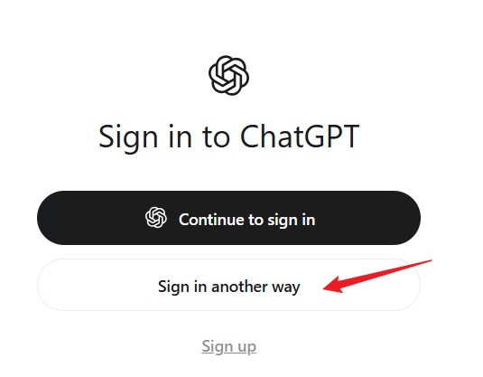
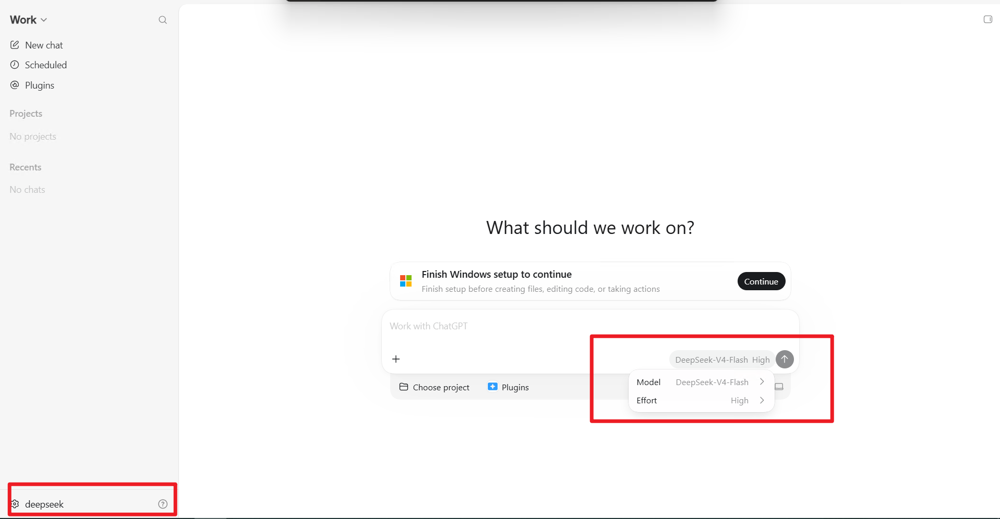
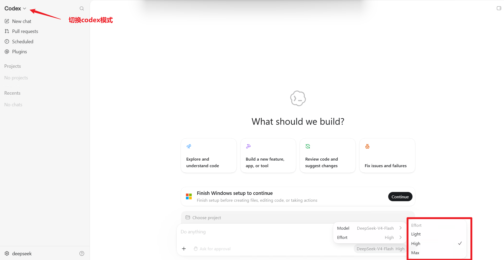
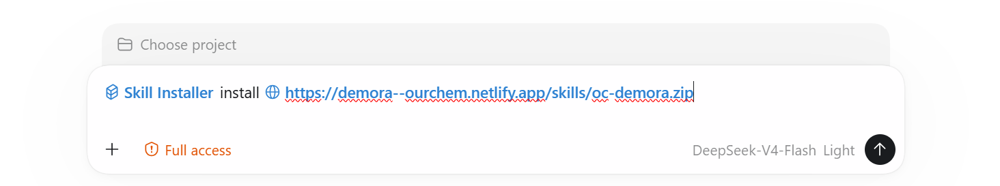

## 安装
### 下载安装包
https://apps.microsoft.com/detail/9plm9xgg6vks
### 登录
如有gpt账号直接登录，如无，按以下操作：

随便输入key，如：123456，也可以进去应用界面

### 配置
#### 配置大模型
推荐 deepseek-v4-flash 及以上档位的大模型，如 qwen-3.8-flash、glm-5.3-flash。

C:\Users\你的用户名\.codex\config.toml
修改：
model = "大模型名称"
model_provider = "大模型提供方名称"
增加：
[model_providers.大模型提供方名称]
name = "大模型名称"
base_url = "https://api.deepseek.com/" # 修改端点
wire_api = "responses"
experimental_bearer_token = "xxxxxxxxxxxxxxx" # 改key
##### 部分大模型提供一键配置脚本，如deepseek-v4-flash
deepseek提供直接配置脚本， powershell可运行：
```
irm https://cdn.deepseek.com/api-docs/codex-deepseek-setup-en.ps1 | iex
```
过程中按提示选择大模型、输入key，完成后重启codex
将看到


#### 打开高档位（否则部分大模型可能看不到最高档位选项）
C:\Users\你的用户名\.codex\config.toml

[desktop] 章节增加配置
enabled-reasoning-efforts = ["low", "medium", "high", "xhigh", "max", "ultra"]
model_reasoning_effort = "max"   # 默认档，可选

重启codex，将看到


### 安装与更新skill
codex直接运行
```
## 安装
$skill-installer install https://demora--ourchem.netlify.app/skills/oc-demora.zip
## 更新
$skill-installer update https://demora--ourchem.netlify.app/skills/oc-demora.zip
```

codex 中运行后可直接看到安装结果：


