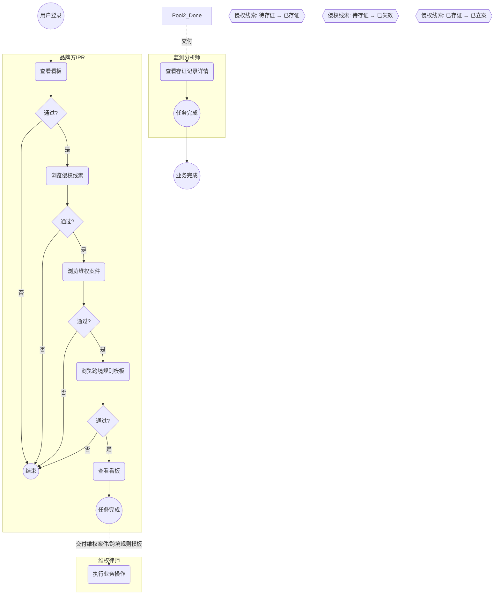
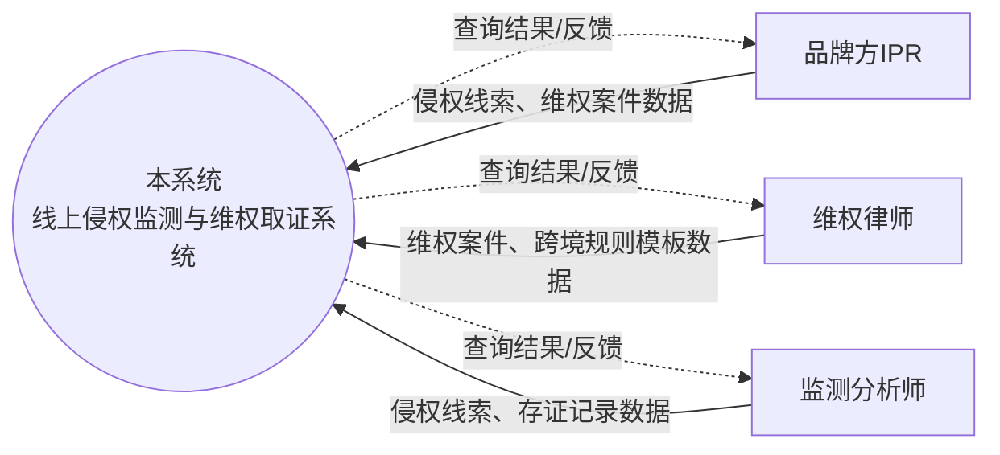
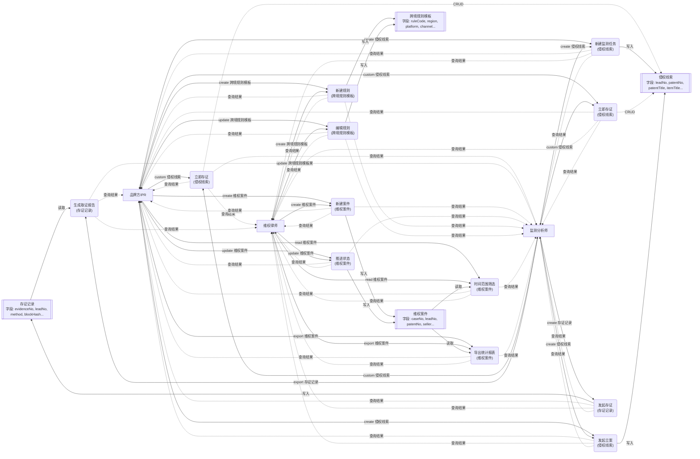
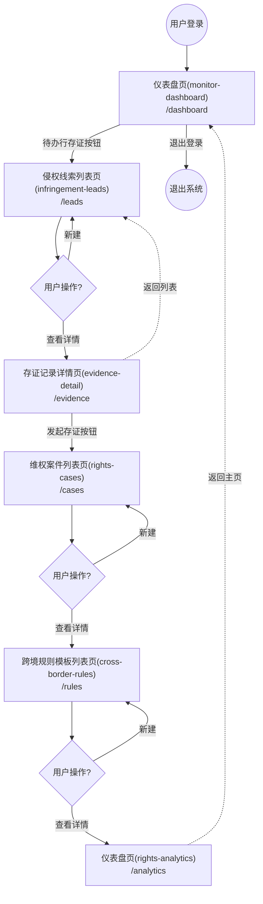
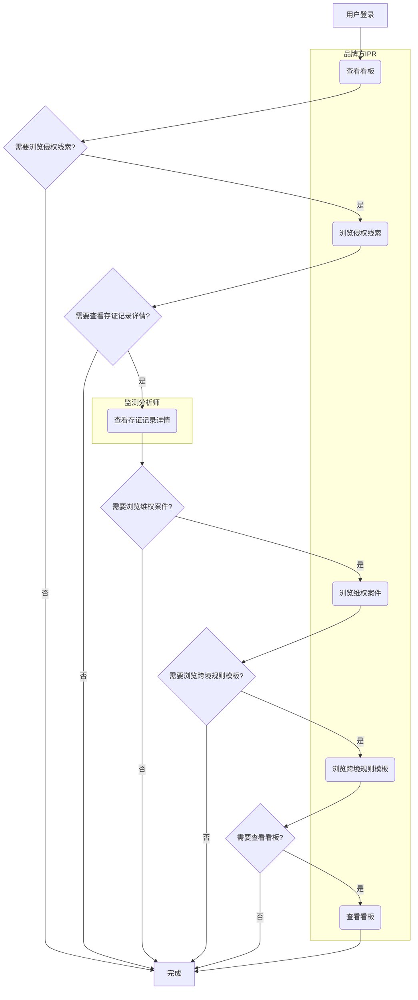
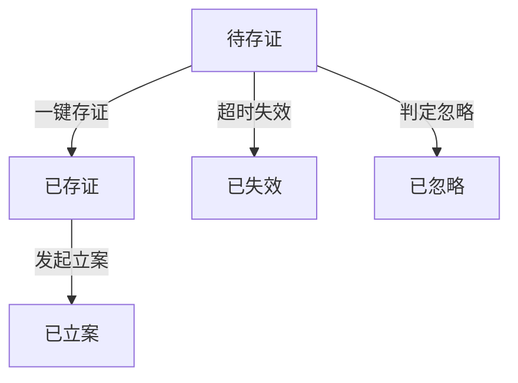
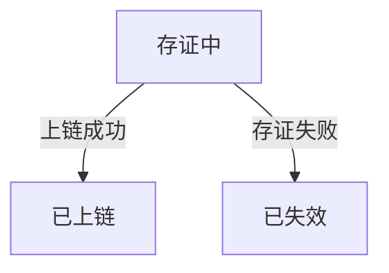
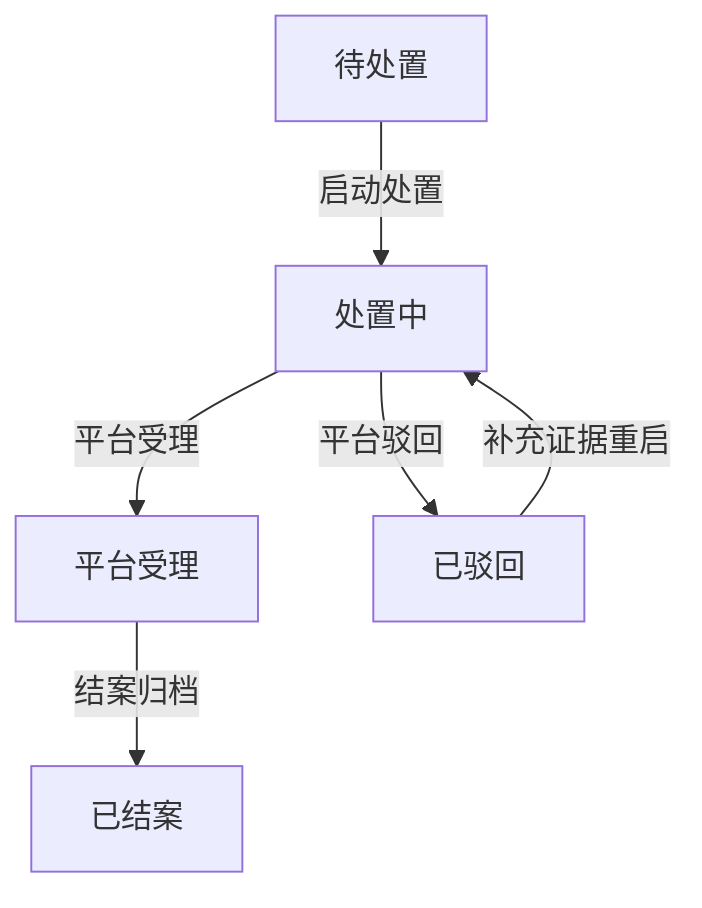
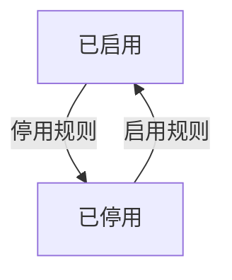

# 04 - 业务流程

> 本文档描述系统的任务流（Task Flow）、数据流（Data Flow）、页面流（Page Flow）、主流程、分支流程、异常流程及状态流转规则。

> 模板版本：v5.7  |  章节契约：与 04-business-flow.md 模板严格对齐

---

## Task Flow（任务流，BPMN 2.0）

> **业界标准**：BPMN 2.0（Business Process Model and Notation）
> **关注点**：用户完成业务任务的操作步骤序列，按角色分 Pool/Lane。
> **图例**：`(( ))` 事件 / `( )` 任务 / `{ }` 网关 / 实线=Sequence Flow / 虚线=Message Flow

### BPMN 任务流图

### 角色任务清单（BPMN Pool/Lane 视角）

| 角色 (Pool) | 任务 (Task) | 触发条件 | 关联页面 | 关联实体 | 交付物 |
|------|------|----------|----------|---------|--------|
| 品牌方IPR | 查看看板 | 登录后进入工作台 | 仪表盘页(monitor-dashboard) | 侵权线索、维权案件、跨境规则模板 | 业务数据 |
| 维权律师 | 执行业务操作 | 登录后进入工作台 | - | 维权案件、跨境规则模板 | 业务数据 |
| 监测分析师 | 查看存证记录详情 | 登录后进入工作台 | 存证记录详情页(evidence-detail) | 侵权线索、存证记录 | 业务数据 |

---

## Data Flow（数据流，DFD Yourdon-DeMarco）

> **业界标准**：DFD（Data Flow Diagram，Yourdon-DeMarco notation）
> **关注点**：数据在系统各模块/角色间的流动路径，含数据归属与操作权限。
> **图例**：`[ ]` 外部实体 / `( )` 处理过程 / `[[ ]]` 数据存储 / 箭头标签=数据流内容

### Level 0 - 上下文图（Context Diagram）

### Level 1 - 数据流分解图

### 实体数据归属矩阵

| 实体 | 所有者角色 | 可读角色 | 可写角色 | 数据流向 | 主键字段 | 关键字段 |
|------|------------|----------|----------|----------|---------|---------|
| 侵权线索 | 品牌方IPR | 品牌方IPR/维权律师/监测分析师 | 品牌方IPR/监测分析师 | 品牌方IPR → [侵权线索] → 品牌方IPR | id | leadNo, patentNo, patentTitle |
| 存证记录 | 监测分析师 | 品牌方IPR/维权律师/监测分析师 | 监测分析师 | 监测分析师 → [存证记录] → 品牌方IPR | id | evidenceNo, leadNo, method |
| 维权案件 | 品牌方IPR | 品牌方IPR/维权律师/监测分析师 | 品牌方IPR/维权律师 | 品牌方IPR → [维权案件] → 品牌方IPR | id | caseNo, leadNo, patentNo |
| 跨境规则模板 | 品牌方IPR | 品牌方IPR/维权律师/监测分析师 | 品牌方IPR/维权律师 | 品牌方IPR → [跨境规则模板] → 品牌方IPR | id | ruleCode, region, platform |

### 数据流层级说明

- **Level 0 - Context Diagram**：将整个系统视为单一 Process，展示外部实体与系统的交互边界
- **Level 1 - 数据流分解图**：将系统分解为多个 Process（页面操作），展示 Process 与 Data Store（实体）的数据交互
- **建议进一步分解**：复杂 Process 可继续分解为 Level 2 / Level 3 DFD

---

## Page Flow（页面流，UI Flow Diagram）

> **业界标准**：UI Flow Diagram（用户界面流程图）
> **关注点**：页面间的跳转关系，含路由、跳转条件与决策分支。
> **图例**：`(( ))` 起止节点 / `[ ]` 页面 / `{ }` 决策点 / 实线=跳转 / 虚线=返回

### UI Flow 页面跳转图

### 路由表与跳转条件

| 源页面 | 目标页面 | 触发条件 | 传参 | 权限要求 | 跳转类型 |
|--------|----------|----------|------|----------|---------|
| 登录页 | 仪表盘页(monitor-dashboard) | 用户登录成功 | userId | 已认证 | 路由跳转 |
| 仪表盘页(monitor-dashboard) | 侵权线索列表页(infringement-leads) | 点击待办行存证按钮 | InfringementLead | 已认证 | 路由跳转 |
| 侵权线索列表页(infringement-leads) | 存证记录详情页(evidence-detail) | 点击行内存证按钮 | InfringementLead | 已认证 | 路由跳转 |
| 存证记录详情页(evidence-detail) | 维权案件列表页(rights-cases) | 点击发起存证按钮 | EvidenceRecord | 已认证 | 路由跳转 |
| 维权案件列表页(rights-cases) | 跨境规则模板列表页(cross-border-rules) | 点击新建案件按钮 | RightsCase | 已认证 | 路由跳转 |
| 跨境规则模板列表页(cross-border-rules) | 仪表盘页(rights-analytics) | 点击新建规则按钮 | CrossBorderRule | 已认证 | 路由跳转 |
| 仪表盘页(rights-analytics) | 仪表盘页(monitor-dashboard) | 点击返回/面包屑 | - | 已认证 | 返回 |

### 跳转模式说明

- **列表 → 详情**：用户在列表页点击行项目，跳转到详情页查看完整信息
- **列表 → 表单**：用户在列表页点击"新建"按钮，跳转到表单页录入数据
- **详情 → 列表**：用户在详情页点击"返回"，回到列表页
- **任意页 → 主页**：用户点击面包屑或 Logo，返回主页
- **退出登录**：用户点击退出按钮，终止会话

---

## 主流程（业务流程）

> 系统的核心业务流程，端到端的操作序列（按角色泳道划分）。

### 业务流程图（按角色泳道）

### 主流程步骤说明

**步骤 1：查看看板**
- 页面 ID：P01
- 页面类型：仪表盘页
- 关联实体：侵权线索
- 路由：/dashboard

**步骤 2：浏览侵权线索**
- 页面 ID：P02
- 页面类型：CRUD 列表页
- 关联实体：侵权线索
- 路由：/leads

**步骤 3：查看存证记录详情**
- 页面 ID：P03
- 页面类型：详情页
- 关联实体：存证记录
- 路由：/evidence

**步骤 4：浏览维权案件**
- 页面 ID：P04
- 页面类型：CRUD 列表页
- 关联实体：维权案件
- 路由：/cases

**步骤 5：浏览跨境规则模板**
- 页面 ID：P05
- 页面类型：CRUD 列表页
- 关联实体：跨境规则模板
- 路由：/rules

**步骤 6：查看看板**
- 页面 ID：P06
- 页面类型：仪表盘页
- 关联实体：维权案件
- 路由：/analytics

---

## 分支流程

### 分支一：侵权线索状态流转

- **待存证 -> 已存证**：触发=一键存证，条件=命中后 24 小时内完成区块链存证
- **待存证 -> 已失效**：触发=超时失效，条件=超过存证截止时间仍未完成存证
- **已存证 -> 已立案**：触发=发起立案，条件=同一卖家同一专利无在办案件
- **待存证 -> 已忽略**：触发=判定忽略，条件=分析师复核为不侵权或重复线索

### 分支二：存证记录状态流转

- **存证中 -> 已上链**：触发=上链成功，条件=区块链网络返回存证哈希与时间戳
- **存证中 -> 已失效**：触发=存证失败，条件=上链超时或证据文件缺失

### 分支三：维权案件状态流转

- **待处置 -> 处置中**：触发=启动处置，条件=已选定处置策略且跨境案件已绑定当地规则模板
- **处置中 -> 平台受理**：触发=平台受理，条件=平台返回受理回执
- **平台受理 -> 已结案**：触发=结案归档，条件=侵权商品已下架或达成和解
- **处置中 -> 已驳回**：触发=平台驳回，条件=证据不足或权利不稳定
- **已驳回 -> 处置中**：触发=补充证据重启，条件=补充存证后重新提交

### 分支四：跨境规则模板状态流转

- **已启用 -> 已停用**：触发=停用规则，条件=平台投诉渠道变更或规则过期
- **已停用 -> 已启用**：触发=启用规则，条件=规则内容复核通过

---

## 异常流程

| 异常场景 | 触发条件 | 处理方式 | 提示信息 |
|----------|----------|----------|----------|
| 数据加载失败 | 网络异常或接口超时 | 显示错误状态页，提供重试按钮 | 数据加载失败，请重试 |
| 权限不足 | 用户访问无权限页面或操作 | 路由守卫拦截，跳转 403 页面 | 您无权访问该页面 |
| 数据校验失败 | 表单提交字段不合规 | 表单内联显示校验错误 | 请检查输入内容 |
| 数据不存在 | 访问已删除/不存在的记录 | 显示 404 空状态页 | 该记录不存在或已删除 |
| 并发冲突 | 多人同时编辑同一记录 | 提交时检测版本冲突，提示刷新 | 数据已被他人修改，请刷新后重试 |

---

## 状态流转

| 实体 | 当前状态 | 允许转换到 | 触发操作 | 触发条件 |
|------|----------|------------|----------|----------|
| 侵权线索 | 待存证 | 已存证 | 一键存证 | 命中后 24 小时内完成区块链存证 |
| 侵权线索 | 待存证 | 已失效 | 超时失效 | 超过存证截止时间仍未完成存证 |
| 侵权线索 | 已存证 | 已立案 | 发起立案 | 同一卖家同一专利无在办案件 |
| 侵权线索 | 待存证 | 已忽略 | 判定忽略 | 分析师复核为不侵权或重复线索 |
| 存证记录 | 存证中 | 已上链 | 上链成功 | 区块链网络返回存证哈希与时间戳 |
| 存证记录 | 存证中 | 已失效 | 存证失败 | 上链超时或证据文件缺失 |
| 维权案件 | 待处置 | 处置中 | 启动处置 | 已选定处置策略且跨境案件已绑定当地规则模板 |
| 维权案件 | 处置中 | 平台受理 | 平台受理 | 平台返回受理回执 |
| 维权案件 | 平台受理 | 已结案 | 结案归档 | 侵权商品已下架或达成和解 |
| 维权案件 | 处置中 | 已驳回 | 平台驳回 | 证据不足或权利不稳定 |
| 维权案件 | 已驳回 | 处置中 | 补充证据重启 | 补充存证后重新提交 |
| 跨境规则模板 | 已启用 | 已停用 | 停用规则 | 平台投诉渠道变更或规则过期 |
| 跨境规则模板 | 已停用 | 已启用 | 启用规则 | 规则内容复核通过 |

### 各实体状态枚举

- **侵权线索**：待存证 / 已存证 / 已立案 / 已失效 / 已忽略
- **存证记录**：存证中 / 已上链 / 已失效
- **维权案件**：待处置 / 处置中 / 平台受理 / 已结案 / 已驳回
- **跨境规则模板**：已启用 / 已停用

> 状态字典定义请参见 `status-dictionary.yaml`（由实体状态枚举自动推导）。

---

> 本文档由 generate-prd.mjs (v5.2.2) 基于 requirement-model.yaml 自动生成（2026-08-29T15:52:06.986Z）
