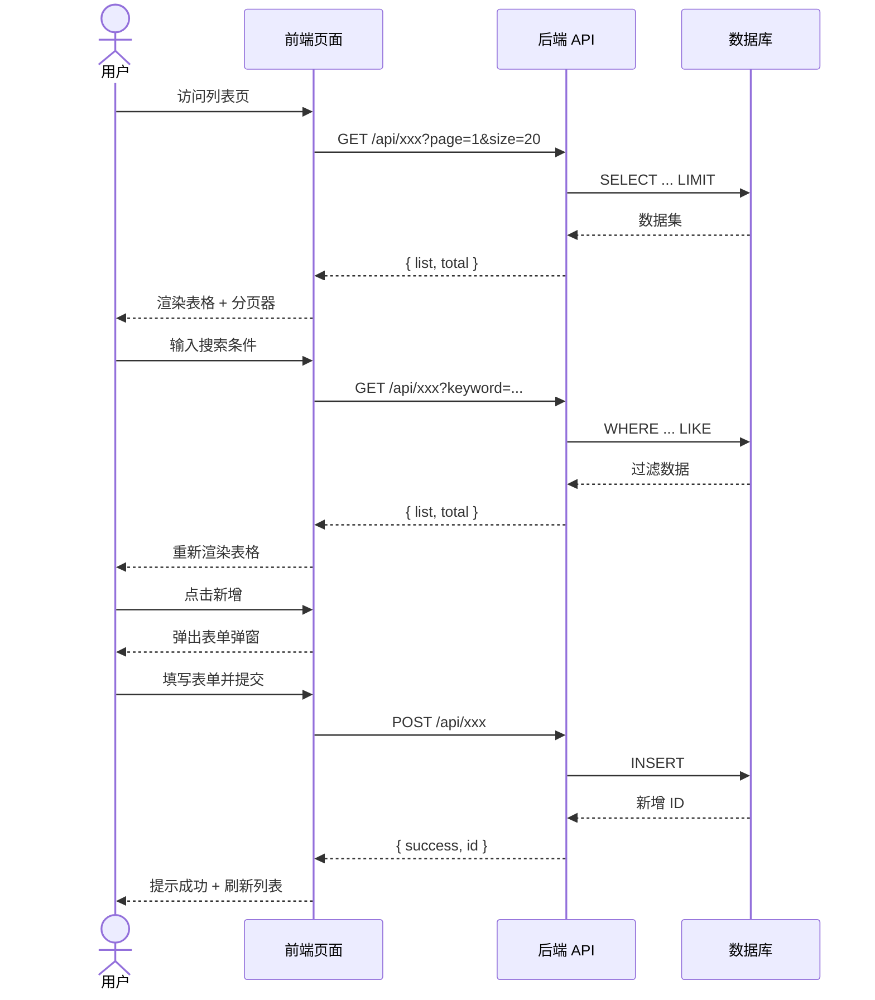
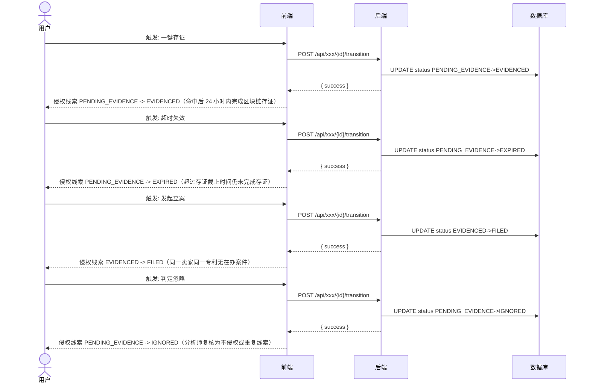
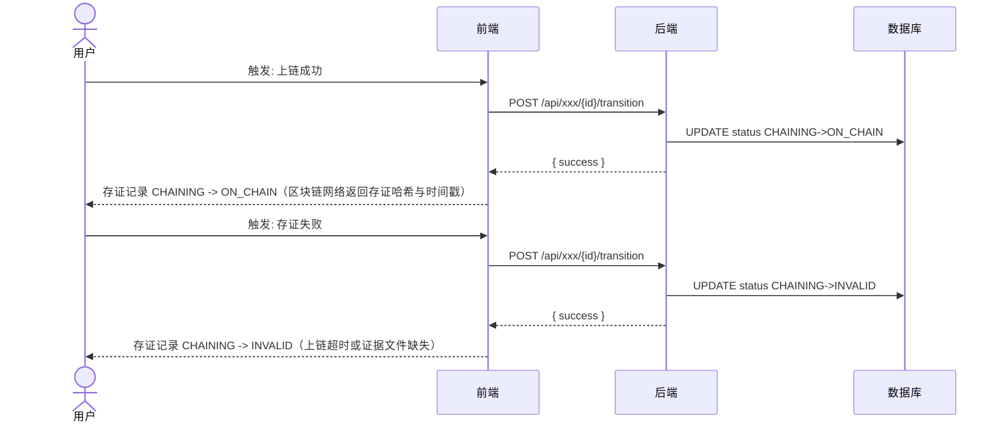
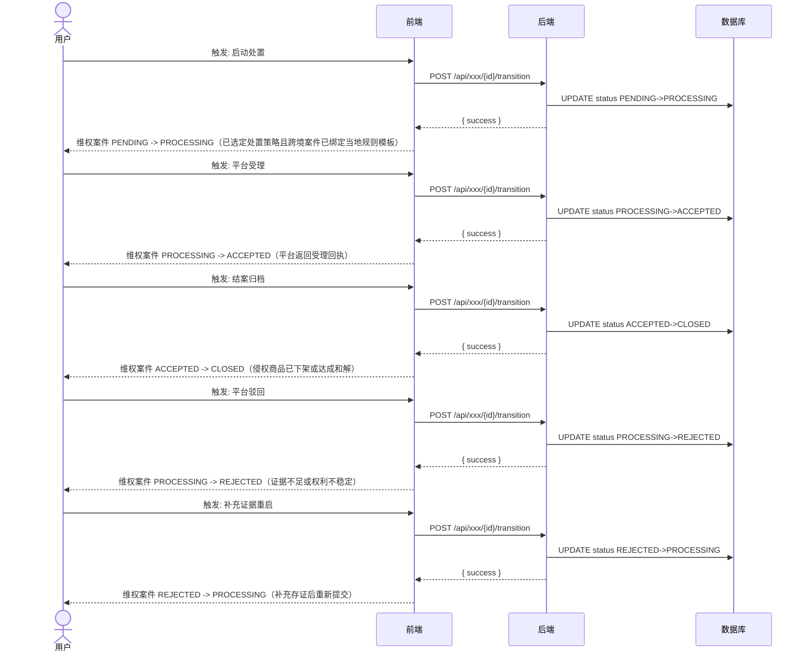
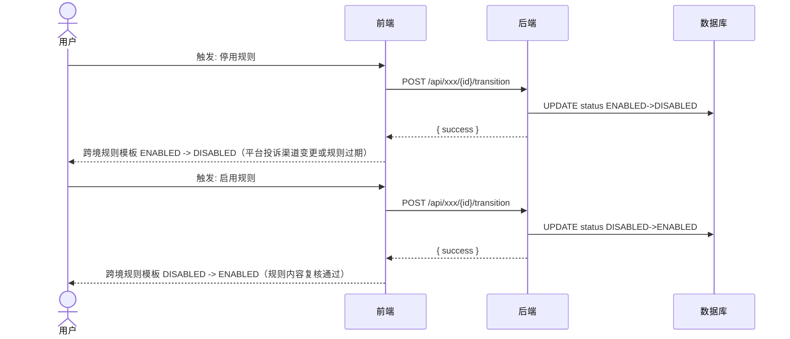
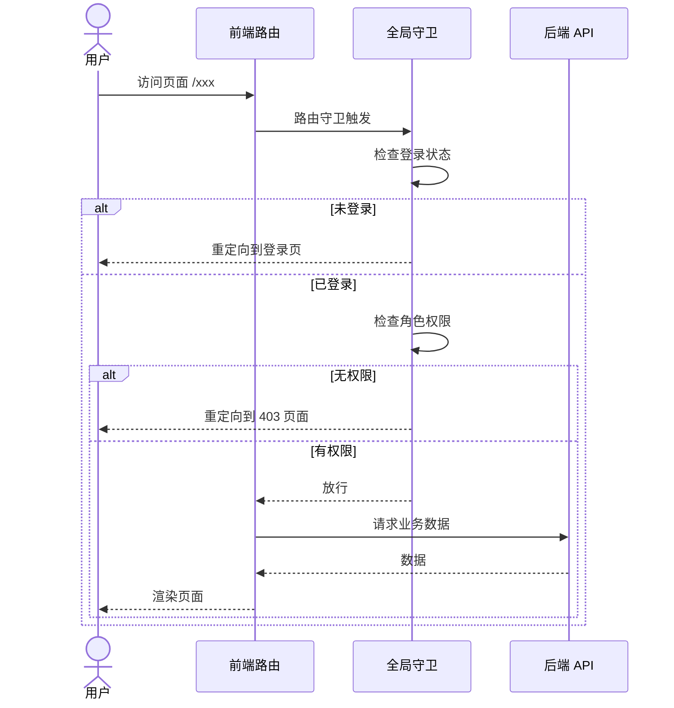
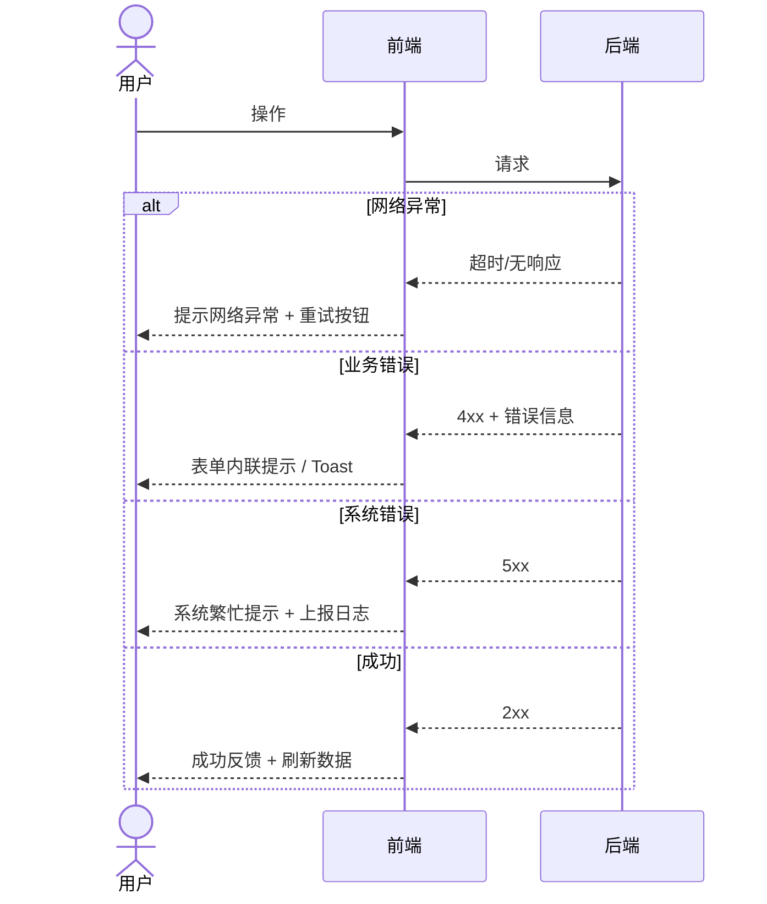

# 02 - 交互流程 (技术规格)

> 本文档定义系统的主要交互流程，覆盖核心业务场景的前后端协作时序。

---

## 1. 文档说明

本文档基于需求模型推导主要交互流程，使用 Mermaid 时序图描述前后端协作。

---

## 2. 通用列表页交互流程

以 monitor-dashboard为例，描述 CRUD 列表页的标准交互：

---

## 3. 状态流转交互流程

### 3.1 侵权线索 状态流转

### 3.2 存证记录 状态流转

### 3.3 维权案件 状态流转

### 3.4 跨境规则模板 状态流转

---

## 4. 权限校验流程

---

## 5. 异常处理流程

---

> 本文档由 generate-prd.mjs (v5.2.2) 基于 requirement-model.yaml 自动生成（2026-08-29T15:52:07.046Z）
