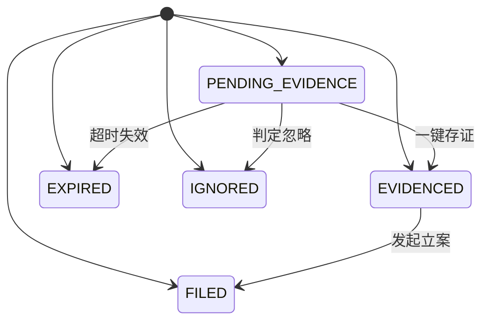
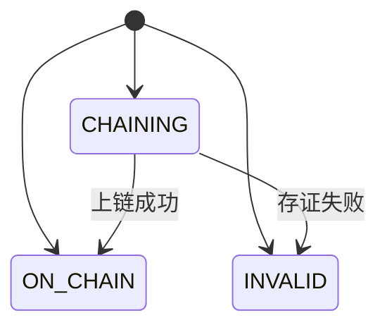
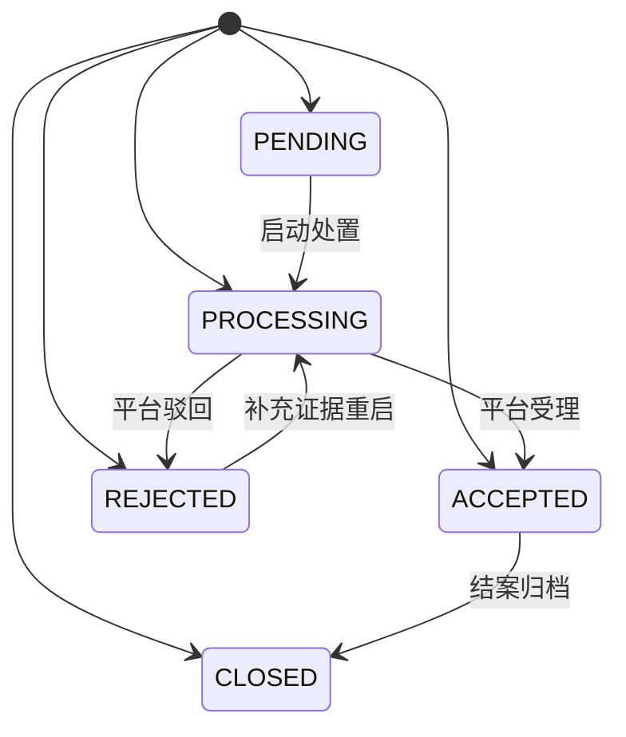
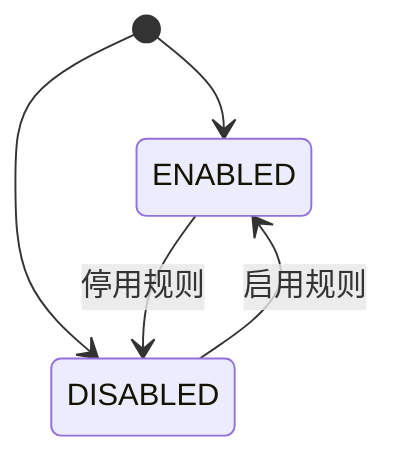

# 03 - 状态矩阵 (技术规格)

> 本文档定义所有实体的状态枚举与状态流转规则，作为状态机实现的依据。

---

## 1. 文档说明

本文档从需求模型提取实体状态枚举与转换规则，用于前后端状态同步与校验。

---

## 2. 状态枚举清单

| 实体 | 状态值 | 显示名称 | 颜色标识 |
|------|--------|---------|---------|
| 侵权线索 | PENDING_EVIDENCE | 待存证 | warning |
| 侵权线索 | EVIDENCED | 已存证 | info |
| 侵权线索 | FILED | 已立案 | primary |
| 侵权线索 | EXPIRED | 已失效 | danger |
| 侵权线索 | IGNORED | 已忽略 | info |
| 存证记录 | CHAINING | 存证中 | warning |
| 存证记录 | ON_CHAIN | 已上链 | success |
| 存证记录 | INVALID | 已失效 | danger |
| 维权案件 | PENDING | 待处置 | warning |
| 维权案件 | PROCESSING | 处置中 | primary |
| 维权案件 | ACCEPTED | 平台受理 | info |
| 维权案件 | CLOSED | 已结案 | success |
| 维权案件 | REJECTED | 已驳回 | danger |
| 跨境规则模板 | ENABLED | 已启用 | success |
| 跨境规则模板 | DISABLED | 已停用 | info |

---

## 3. 状态转换矩阵

| 实体 | 起始状态 | 目标状态 | 触发动作 | 前置条件 |
|------|---------|---------|---------|---------|
| 侵权线索 | PENDING_EVIDENCE | EVIDENCED | 一键存证 | 命中后 24 小时内完成区块链存证 |
| 侵权线索 | PENDING_EVIDENCE | EXPIRED | 超时失效 | 超过存证截止时间仍未完成存证 |
| 侵权线索 | EVIDENCED | FILED | 发起立案 | 同一卖家同一专利无在办案件 |
| 侵权线索 | PENDING_EVIDENCE | IGNORED | 判定忽略 | 分析师复核为不侵权或重复线索 |
| 存证记录 | CHAINING | ON_CHAIN | 上链成功 | 区块链网络返回存证哈希与时间戳 |
| 存证记录 | CHAINING | INVALID | 存证失败 | 上链超时或证据文件缺失 |
| 维权案件 | PENDING | PROCESSING | 启动处置 | 已选定处置策略且跨境案件已绑定当地规则模板 |
| 维权案件 | PROCESSING | ACCEPTED | 平台受理 | 平台返回受理回执 |
| 维权案件 | ACCEPTED | CLOSED | 结案归档 | 侵权商品已下架或达成和解 |
| 维权案件 | PROCESSING | REJECTED | 平台驳回 | 证据不足或权利不稳定 |
| 维权案件 | REJECTED | PROCESSING | 补充证据重启 | 补充存证后重新提交 |
| 跨境规则模板 | ENABLED | DISABLED | 停用规则 | 平台投诉渠道变更或规则过期 |
| 跨境规则模板 | DISABLED | ENABLED | 启用规则 | 规则内容复核通过 |

---

## 4. 状态机图

### 4.1 侵权线索 状态机

### 4.2 存证记录 状态机

### 4.3 维权案件 状态机

### 4.4 跨境规则模板 状态机

---

## 5. 状态校验规则

| 规则 | 说明 |
|------|------|
| 后端校验 | 每次状态变更必须校验转换合法性，非法转换返回 422 |
| 前端展示 | 根据当前状态动态显示可执行的操作按钮 |
| 日志记录 | 状态变更记录操作日志，含操作人、时间、前后状态 |
| 并发控制 | 状态变更使用乐观锁（version 字段）防止并发冲突 |

---

> 本文档由 generate-prd.mjs (v5.2.2) 基于 requirement-model.yaml 自动生成（2026-08-29T15:52:07.053Z）
