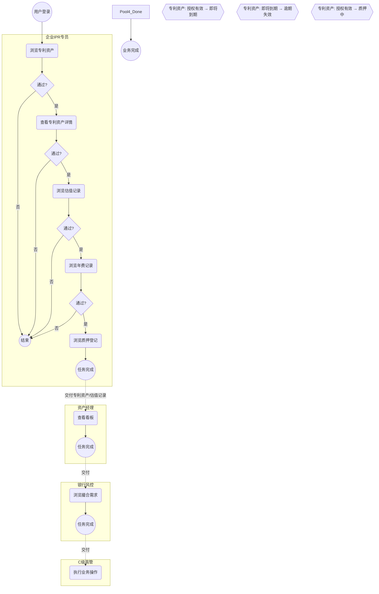
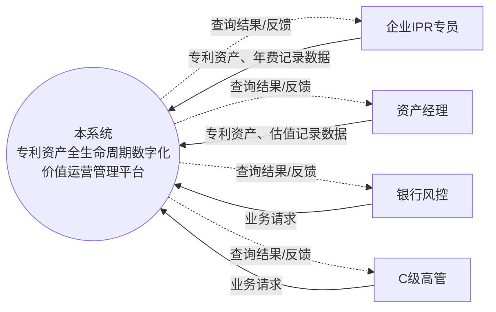
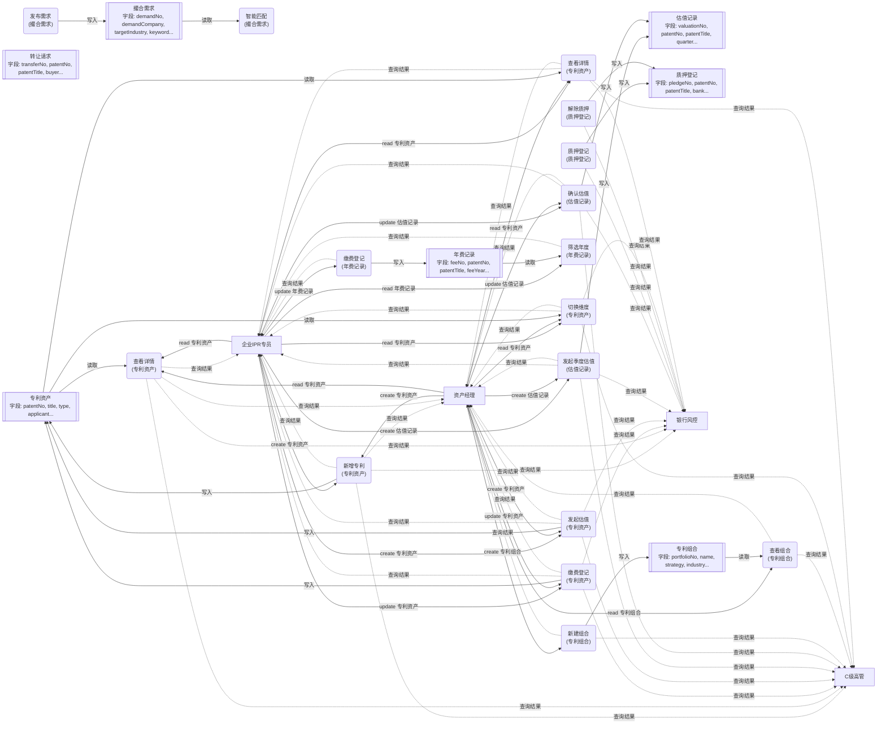
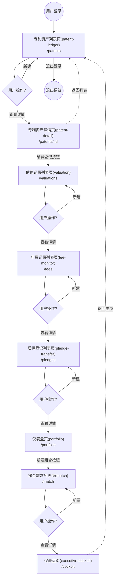
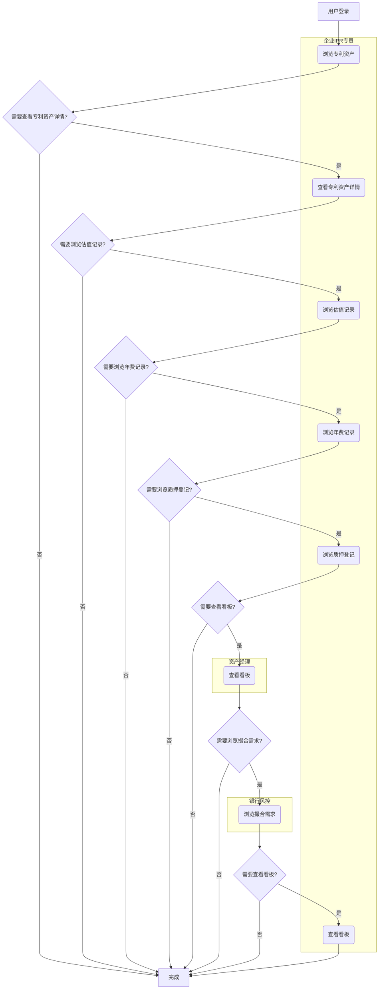
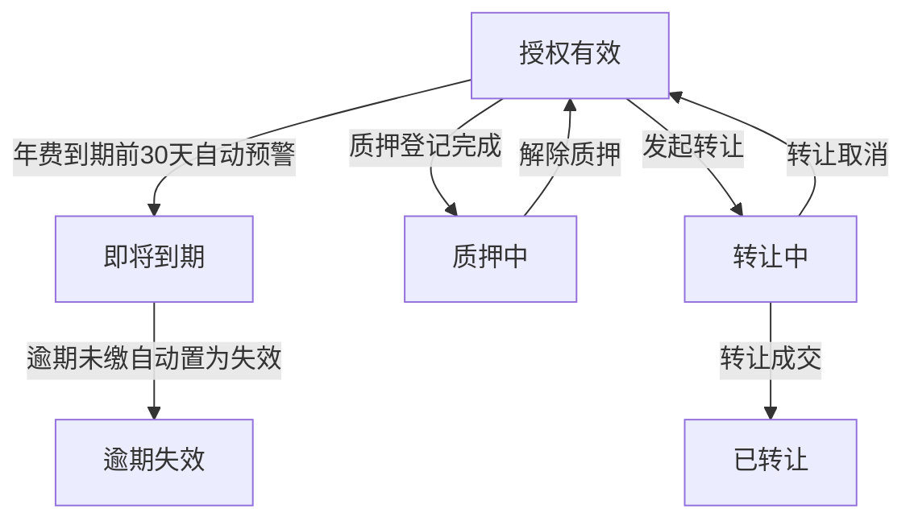
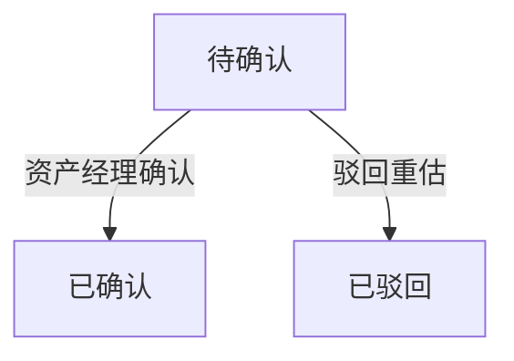
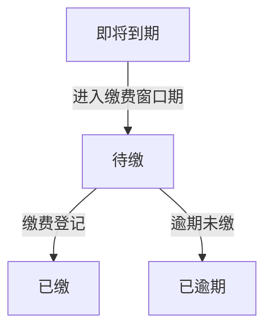
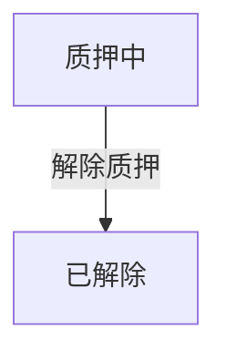
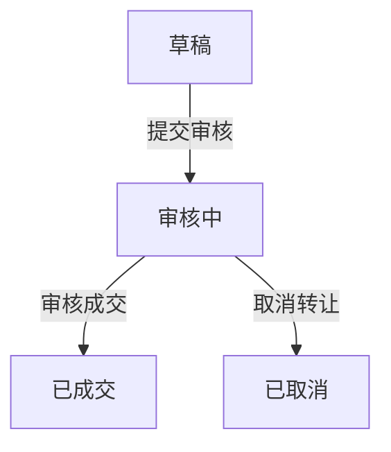

# 04 - 业务流程

> 本文档描述系统的任务流（Task Flow）、数据流（Data Flow）、页面流（Page Flow）、主流程、分支流程、异常流程及状态流转规则。

> 模板版本：v5.7  |  章节契约：与 04-business-flow.md 模板严格对齐

---

## Task Flow（任务流，BPMN 2.0）

> **业界标准**：BPMN 2.0（Business Process Model and Notation）
> **关注点**：用户完成业务任务的操作步骤序列，按角色分 Pool/Lane。
> **图例**：`(( ))` 事件 / `( )` 任务 / `{ }` 网关 / 实线=Sequence Flow / 虚线=Message Flow

### BPMN 任务流图

### 角色任务清单（BPMN Pool/Lane 视角）

| 角色 (Pool) | 任务 (Task) | 触发条件 | 关联页面 | 关联实体 | 交付物 |
|------|------|----------|----------|---------|--------|
| 企业IPR专员 | 浏览专利资产 | 登录后进入工作台 | 专利资产列表页(patent-ledger) | 专利资产、年费记录、估值记录 | 业务数据 |
| 资产经理 | 查看看板 | 登录后进入工作台 | 仪表盘页(portfolio) | 专利资产、估值记录、专利组合、转让请求 | 业务数据 |
| 银行风控 | 浏览撮合需求 | 登录后进入工作台 | 撮合需求列表页(match) | - | 业务数据 |
| C级高管 | 执行业务操作 | 登录后进入工作台 | - | - | 业务数据 |

---

## Data Flow（数据流，DFD Yourdon-DeMarco）

> **业界标准**：DFD（Data Flow Diagram，Yourdon-DeMarco notation）
> **关注点**：数据在系统各模块/角色间的流动路径，含数据归属与操作权限。
> **图例**：`[ ]` 外部实体 / `( )` 处理过程 / `[[ ]]` 数据存储 / 箭头标签=数据流内容

### Level 0 - 上下文图（Context Diagram）

### Level 1 - 数据流分解图

### 实体数据归属矩阵

| 实体 | 所有者角色 | 可读角色 | 可写角色 | 数据流向 | 主键字段 | 关键字段 |
|------|------------|----------|----------|----------|---------|---------|
| 专利资产 | 企业IPR专员 | 企业IPR专员/资产经理/银行风控/C级高管 | 企业IPR专员/资产经理 | 企业IPR专员 → [专利资产] → 企业IPR专员 | id | patentNo, title, type |
| 估值记录 | 企业IPR专员 | 企业IPR专员/资产经理/银行风控/C级高管 | 企业IPR专员/资产经理 | 企业IPR专员 → [估值记录] → 企业IPR专员 | id | valuationNo, patentNo, patentTitle |
| 年费记录 | - | 企业IPR专员 | 企业IPR专员 | 内部流转 | id | feeNo, patentNo, patentTitle |
| 质押登记 | - | 银行风控 | - | 内部流转 | id | pledgeNo, patentNo, patentTitle |
| 转让请求 | 资产经理 | 资产经理 | 资产经理 | 资产经理 → [转让请求] → 资产经理 | id | transferNo, patentNo, patentTitle |
| 专利组合 | 资产经理 | 资产经理/C级高管 | 资产经理 | 资产经理 → [专利组合] → 资产经理 | id | portfolioNo, name, strategy |
| 撮合需求 | - | 所有角色 | - | 内部流转 | id | demandNo, demandCompany, targetIndustry |

### 数据流层级说明

- **Level 0 - Context Diagram**：将整个系统视为单一 Process，展示外部实体与系统的交互边界
- **Level 1 - 数据流分解图**：将系统分解为多个 Process（页面操作），展示 Process 与 Data Store（实体）的数据交互
- **建议进一步分解**：复杂 Process 可继续分解为 Level 2 / Level 3 DFD

---

## Page Flow（页面流，UI Flow Diagram）

> **业界标准**：UI Flow Diagram（用户界面流程图）
> **关注点**：页面间的跳转关系，含路由、跳转条件与决策分支。
> **图例**：`(( ))` 起止节点 / `[ ]` 页面 / `{ }` 决策点 / 实线=跳转 / 虚线=返回

### UI Flow 页面跳转图

### 路由表与跳转条件

| 源页面 | 目标页面 | 触发条件 | 传参 | 权限要求 | 跳转类型 |
|--------|----------|----------|------|----------|---------|
| 登录页 | 专利资产列表页(patent-ledger) | 用户登录成功 | userId | 已认证 | 路由跳转 |
| 专利资产列表页(patent-ledger) | 专利资产详情页(patent-detail) | 点击新增按钮打开表单弹窗 | Patent | 已认证 | 模态/抽屉 |
| 专利资产详情页(patent-detail) | 估值记录列表页(valuation) | 点击缴费登记按钮 | Patent | 已认证 | 路由跳转 |
| 估值记录列表页(valuation) | 年费记录列表页(fee-monitor) | 点击发起季度估值按钮 | Valuation | 已认证 | 路由跳转 |
| 年费记录列表页(fee-monitor) | 质押登记列表页(pledge-transfer) | 点击行缴费登记按钮 | AnnualFee | 已认证 | 路由跳转 |
| 质押登记列表页(pledge-transfer) | 仪表盘页(portfolio) | 点击质押登记按钮 | Pledge | 已认证 | 路由跳转 |
| 仪表盘页(portfolio) | 撮合需求列表页(match) | 点击新建组合按钮 | Portfolio | 已认证 | 路由跳转 |
| 撮合需求列表页(match) | 仪表盘页(executive-cockpit) | 点击发布需求按钮 | MatchDemand | 已认证 | 路由跳转 |
| 仪表盘页(executive-cockpit) | 专利资产列表页(patent-ledger) | 点击返回/面包屑 | - | 已认证 | 返回 |

### 跳转模式说明

- **列表 → 详情**：用户在列表页点击行项目，跳转到详情页查看完整信息
- **列表 → 表单**：用户在列表页点击"新建"按钮，跳转到表单页录入数据
- **详情 → 列表**：用户在详情页点击"返回"，回到列表页
- **任意页 → 主页**：用户点击面包屑或 Logo，返回主页
- **退出登录**：用户点击退出按钮，终止会话

---

## 主流程（业务流程）

> 系统的核心业务流程，端到端的操作序列（按角色泳道划分）。

### 业务流程图（按角色泳道）

### 主流程步骤说明

**步骤 1：浏览专利资产**
- 页面 ID：P01
- 页面类型：CRUD 列表页
- 关联实体：专利资产
- 路由：/patents

**步骤 2：查看专利资产详情**
- 页面 ID：P02
- 页面类型：详情页
- 关联实体：专利资产
- 路由：/patents/:id

**步骤 3：浏览估值记录**
- 页面 ID：P03
- 页面类型：CRUD 列表页
- 关联实体：估值记录
- 路由：/valuations

**步骤 4：浏览年费记录**
- 页面 ID：P04
- 页面类型：CRUD 列表页
- 关联实体：年费记录
- 路由：/fees

**步骤 5：浏览质押登记**
- 页面 ID：P05
- 页面类型：CRUD 列表页
- 关联实体：质押登记
- 路由：/pledges

**步骤 6：查看看板**
- 页面 ID：P06
- 页面类型：仪表盘页
- 关联实体：专利组合
- 路由：/portfolio

**步骤 7：浏览撮合需求**
- 页面 ID：P07
- 页面类型：CRUD 列表页
- 关联实体：撮合需求
- 路由：/match

**步骤 8：查看看板**
- 页面 ID：P08
- 页面类型：仪表盘页
- 关联实体：专利资产
- 路由：/cockpit

---

## 分支流程

### 分支一：专利资产状态流转

- **授权有效 -> 即将到期**：触发=年费到期前30天自动预警，条件=距离年费到期日不超过30天且尚未缴费
- **即将到期 -> 逾期失效**：触发=逾期未缴自动置为失效，条件=超过年费到期日仍未缴纳
- **授权有效 -> 质押中**：触发=质押登记完成，条件=-
- **质押中 -> 授权有效**：触发=解除质押，条件=-
- **授权有效 -> 转让中**：触发=发起转让，条件=专利未处于质押中
- **转让中 -> 已转让**：触发=转让成交，条件=-
- **转让中 -> 授权有效**：触发=转让取消，条件=-

### 分支二：估值记录状态流转

- **待确认 -> 已确认**：触发=资产经理确认，条件=-
- **待确认 -> 已驳回**：触发=驳回重估，条件=-

### 分支三：年费记录状态流转

- **即将到期 -> 待缴**：触发=进入缴费窗口期，条件=-
- **待缴 -> 已缴**：触发=缴费登记，条件=-
- **待缴 -> 已逾期**：触发=逾期未缴，条件=-

### 分支四：质押登记状态流转

- **质押中 -> 已解除**：触发=解除质押，条件=-

### 分支五：转让请求状态流转

- **草稿 -> 审核中**：触发=提交审核，条件=-
- **审核中 -> 已成交**：触发=审核成交，条件=-
- **审核中 -> 已取消**：触发=取消转让，条件=-

---

## 异常流程

| 异常场景 | 触发条件 | 处理方式 | 提示信息 |
|----------|----------|----------|----------|
| 数据加载失败 | 网络异常或接口超时 | 显示错误状态页，提供重试按钮 | 数据加载失败，请重试 |
| 权限不足 | 用户访问无权限页面或操作 | 路由守卫拦截，跳转 403 页面 | 您无权访问该页面 |
| 数据校验失败 | 表单提交字段不合规 | 表单内联显示校验错误 | 请检查输入内容 |
| 数据不存在 | 访问已删除/不存在的记录 | 显示 404 空状态页 | 该记录不存在或已删除 |
| 并发冲突 | 多人同时编辑同一记录 | 提交时检测版本冲突，提示刷新 | 数据已被他人修改，请刷新后重试 |

---

## 状态流转

| 实体 | 当前状态 | 允许转换到 | 触发操作 | 触发条件 |
|------|----------|------------|----------|----------|
| 专利资产 | 授权有效 | 即将到期 | 年费到期前30天自动预警 | 距离年费到期日不超过30天且尚未缴费 |
| 专利资产 | 即将到期 | 逾期失效 | 逾期未缴自动置为失效 | 超过年费到期日仍未缴纳 |
| 专利资产 | 授权有效 | 质押中 | 质押登记完成 | - |
| 专利资产 | 质押中 | 授权有效 | 解除质押 | - |
| 专利资产 | 授权有效 | 转让中 | 发起转让 | 专利未处于质押中 |
| 专利资产 | 转让中 | 已转让 | 转让成交 | - |
| 专利资产 | 转让中 | 授权有效 | 转让取消 | - |
| 估值记录 | 待确认 | 已确认 | 资产经理确认 | - |
| 估值记录 | 待确认 | 已驳回 | 驳回重估 | - |
| 年费记录 | 即将到期 | 待缴 | 进入缴费窗口期 | - |
| 年费记录 | 待缴 | 已缴 | 缴费登记 | - |
| 年费记录 | 待缴 | 已逾期 | 逾期未缴 | - |
| 质押登记 | 质押中 | 已解除 | 解除质押 | - |
| 转让请求 | 草稿 | 审核中 | 提交审核 | - |
| 转让请求 | 审核中 | 已成交 | 审核成交 | - |
| 转让请求 | 审核中 | 已取消 | 取消转让 | - |

### 各实体状态枚举

- **专利资产**：申请中 / 授权有效 / 即将到期 / 逾期失效 / 质押中 / 转让中 / 已转让
- **估值记录**：待确认 / 已确认 / 已驳回
- **年费记录**：已缴 / 待缴 / 即将到期 / 已逾期
- **质押登记**：质押中 / 已解除
- **转让请求**：草稿 / 审核中 / 已成交 / 已取消
- **撮合需求**：发布中 / 匹配中 / 已成交 / 已关闭

> 状态字典定义请参见 `status-dictionary.yaml`（由实体状态枚举自动推导）。

---

> 本文档由 generate-prd.mjs (v5.2.2) 基于 requirement-model.yaml 自动生成（2026-08-30T00:54:23.716Z）
