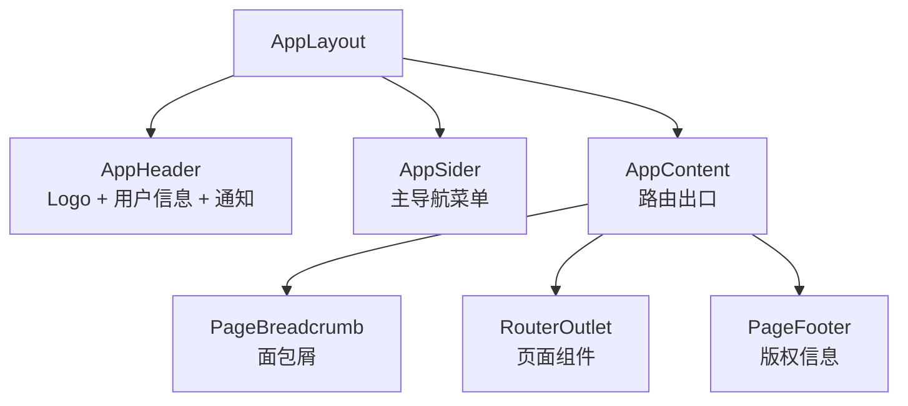
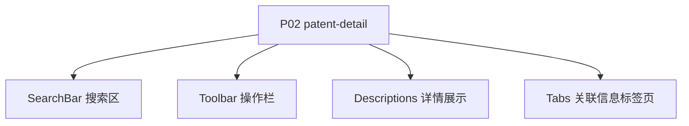
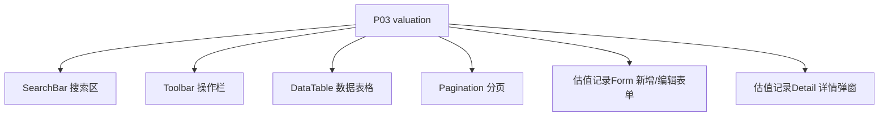
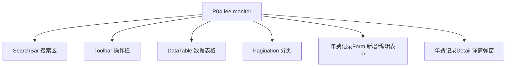
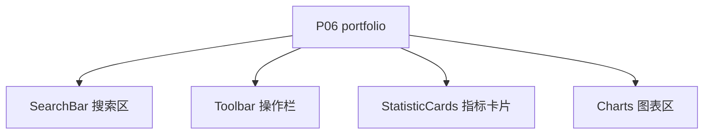
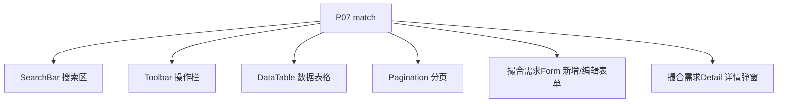
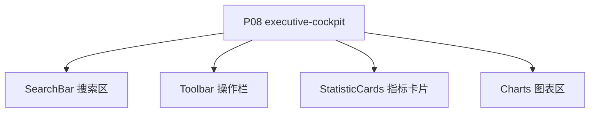

# 01 - 页面架构 (技术规格)

> 本文档定义前端页面的技术架构，包括组件树结构、布局方案、组件清单、通信方式与响应式策略。

---

## 1. 文档说明

本文档基于需求模型中的 8 个页面，推导前端组件架构与布局方案。

---

## 2. 全局布局

### 2.1 布局结构

系统采用经典的中后台布局：顶部导航 + 左侧菜单 + 主内容区。

### 2.2 路由出口

主内容区通过 React Router 的 `<Outlet />` 渲染当前路由对应的页面组件。

---

## 3. 页面组件树

### 3.1 patent-ledger (P01)

### 3.2 patent-detail (P02)

### 3.3 valuation (P03)

### 3.4 fee-monitor (P04)

### 3.5 pledge-transfer (P05)

### 3.6 portfolio (P06)

### 3.7 match (P07)

### 3.8 executive-cockpit (P08)

---

## 4. 公共组件清单

| 组件 | 路径 | 用途 |
|------|------|------|
| AppLayout | components/layout/AppLayout | 全局布局 |
| AppHeader | components/layout/AppHeader | 顶部导航 |
| AppSider | components/layout/AppSider | 侧边菜单 |
| PageBreadcrumb | components/layout/PageBreadcrumb | 面包屑 |
| SearchBar | components/common/SearchBar | 通用搜索区 |
| DataTable | components/common/DataTable | 通用数据表格 |
| Pagination | components/common/Pagination | 分页器 |
| FormDialog | components/common/FormDialog | 表单弹窗 |
| ConfirmDialog | components/common/ConfirmDialog | 确认弹窗 |
| EmptyState | components/common/EmptyState | 空状态 |
| ErrorBoundary | components/common/ErrorBoundary | 错误边界 |

---

## 5. 业务组件清单

| 组件 | 所属页面 | 用途 |
|------|---------|------|
| P01Page | /patents | patent-ledger页面主组件 |
| P02Page | /patents/:id | patent-detail页面主组件 |
| P03Page | /valuations | valuation页面主组件 |
| P04Page | /fees | fee-monitor页面主组件 |
| P05Page | /pledges | pledge-transfer页面主组件 |
| P06Page | /portfolio | portfolio页面主组件 |
| P07Page | /match | match页面主组件 |
| P08Page | /cockpit | executive-cockpit页面主组件 |

---

## 6. 组件间通信方式

| 通信方式 | 场景 | 说明 |
|----------|------|------|
| Props | 父子组件 | 单向数据流 |
| Context | 全局状态 | 用户信息、主题、权限 |
| State Store | 跨页面共享 | Zustand 全局 store |
| Event Bus | 兄弟组件 | 低频场景，避免滥用 |
| URL Params | 路由跳转 | 详情页参数传递 |

---

## 7. 响应式策略

| 断点 | 宽度 | 布局调整 |
|------|------|---------|
| lg | ≥ 1200px | 默认布局（侧边栏展开） |
| md | 992-1199px | 侧边栏可折叠 |
| sm | 768-991px | 侧边栏抽屉式 |
| xs | < 768px | 不支持，提示使用桌面端 |

> 主要面向桌面端后台管理场景，移动端不做强制适配。

---

> 本文档由 generate-prd.mjs (v5.2.2) 基于 requirement-model.yaml 自动生成（2026-08-30T00:54:23.745Z）
