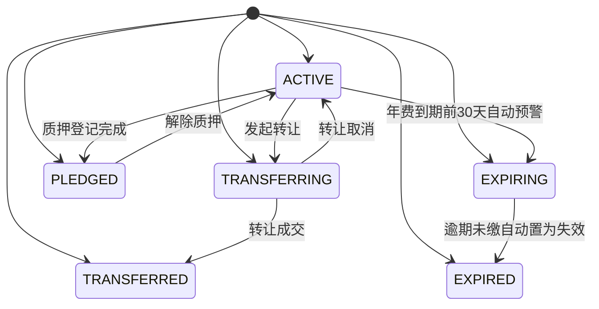
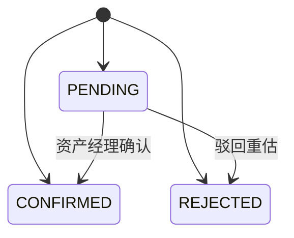
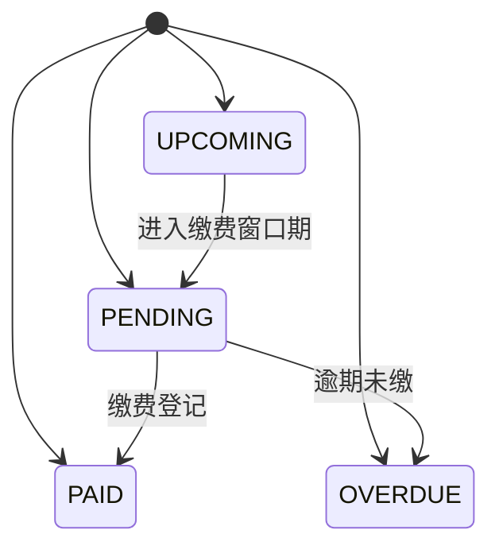
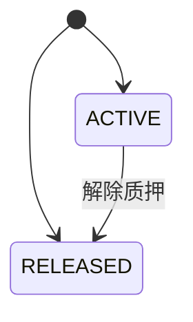
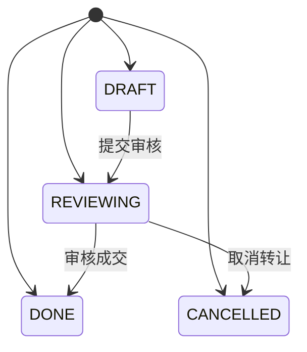

# 03 - 状态矩阵 (技术规格)

> 本文档定义所有实体的状态枚举与状态流转规则，作为状态机实现的依据。

---

## 1. 文档说明

本文档从需求模型提取实体状态枚举与转换规则，用于前后端状态同步与校验。

---

## 2. 状态枚举清单

| 实体 | 状态值 | 显示名称 | 颜色标识 |
|------|--------|---------|---------|
| 专利资产 | APPLYING | 申请中 | info |
| 专利资产 | ACTIVE | 授权有效 | success |
| 专利资产 | EXPIRING | 即将到期 | warning |
| 专利资产 | EXPIRED | 逾期失效 | danger |
| 专利资产 | PLEDGED | 质押中 | primary |
| 专利资产 | TRANSFERRING | 转让中 | warning |
| 专利资产 | TRANSFERRED | 已转让 | info |
| 估值记录 | PENDING | 待确认 | warning |
| 估值记录 | CONFIRMED | 已确认 | success |
| 估值记录 | REJECTED | 已驳回 | danger |
| 年费记录 | PAID | 已缴 | success |
| 年费记录 | PENDING | 待缴 | warning |
| 年费记录 | UPCOMING | 即将到期 | warning |
| 年费记录 | OVERDUE | 已逾期 | danger |
| 质押登记 | ACTIVE | 质押中 | primary |
| 质押登记 | RELEASED | 已解除 | info |
| 转让请求 | DRAFT | 草稿 | info |
| 转让请求 | REVIEWING | 审核中 | warning |
| 转让请求 | DONE | 已成交 | success |
| 转让请求 | CANCELLED | 已取消 | danger |
| 撮合需求 | PUBLISHED | 发布中 | info |
| 撮合需求 | MATCHING | 匹配中 | warning |
| 撮合需求 | DEALT | 已成交 | success |
| 撮合需求 | CLOSED | 已关闭 | danger |

---

## 3. 状态转换矩阵

| 实体 | 起始状态 | 目标状态 | 触发动作 | 前置条件 |
|------|---------|---------|---------|---------|
| 专利资产 | ACTIVE | EXPIRING | 年费到期前30天自动预警 | 距离年费到期日不超过30天且尚未缴费 |
| 专利资产 | EXPIRING | EXPIRED | 逾期未缴自动置为失效 | 超过年费到期日仍未缴纳 |
| 专利资产 | ACTIVE | PLEDGED | 质押登记完成 |  |
| 专利资产 | PLEDGED | ACTIVE | 解除质押 |  |
| 专利资产 | ACTIVE | TRANSFERRING | 发起转让 | 专利未处于质押中 |
| 专利资产 | TRANSFERRING | TRANSFERRED | 转让成交 |  |
| 专利资产 | TRANSFERRING | ACTIVE | 转让取消 |  |
| 估值记录 | PENDING | CONFIRMED | 资产经理确认 |  |
| 估值记录 | PENDING | REJECTED | 驳回重估 |  |
| 年费记录 | UPCOMING | PENDING | 进入缴费窗口期 |  |
| 年费记录 | PENDING | PAID | 缴费登记 |  |
| 年费记录 | PENDING | OVERDUE | 逾期未缴 |  |
| 质押登记 | ACTIVE | RELEASED | 解除质押 |  |
| 转让请求 | DRAFT | REVIEWING | 提交审核 |  |
| 转让请求 | REVIEWING | DONE | 审核成交 |  |
| 转让请求 | REVIEWING | CANCELLED | 取消转让 |  |

---

## 4. 状态机图

### 4.1 专利资产 状态机

### 4.2 估值记录 状态机

### 4.3 年费记录 状态机

### 4.4 质押登记 状态机

### 4.5 转让请求 状态机

---

## 5. 状态校验规则

| 规则 | 说明 |
|------|------|
| 后端校验 | 每次状态变更必须校验转换合法性，非法转换返回 422 |
| 前端展示 | 根据当前状态动态显示可执行的操作按钮 |
| 日志记录 | 状态变更记录操作日志，含操作人、时间、前后状态 |
| 并发控制 | 状态变更使用乐观锁（version 字段）防止并发冲突 |

---

> 本文档由 generate-prd.mjs (v5.2.2) 基于 requirement-model.yaml 自动生成（2026-08-30T00:54:23.752Z）
