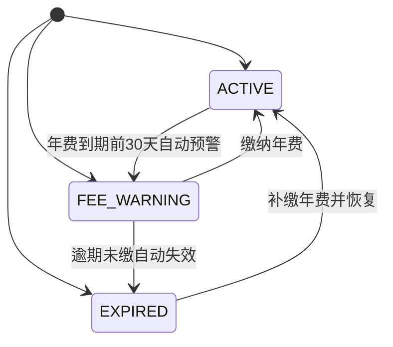
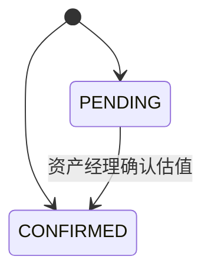
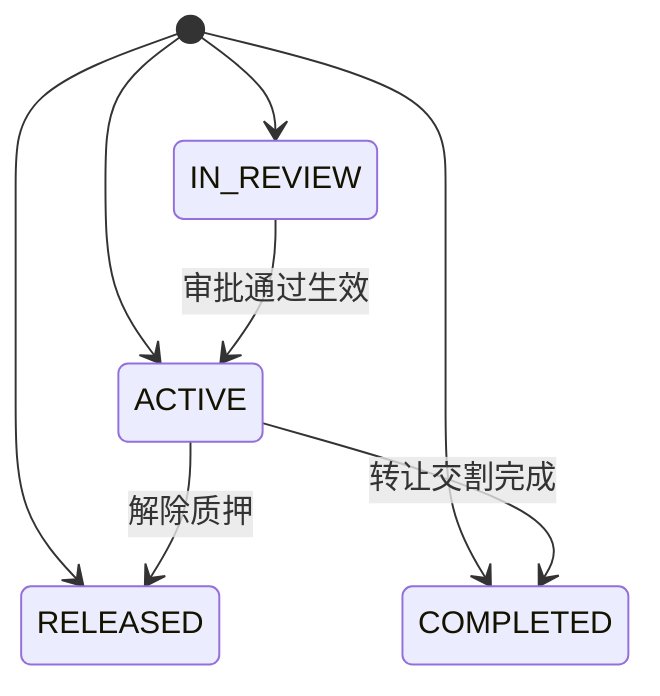
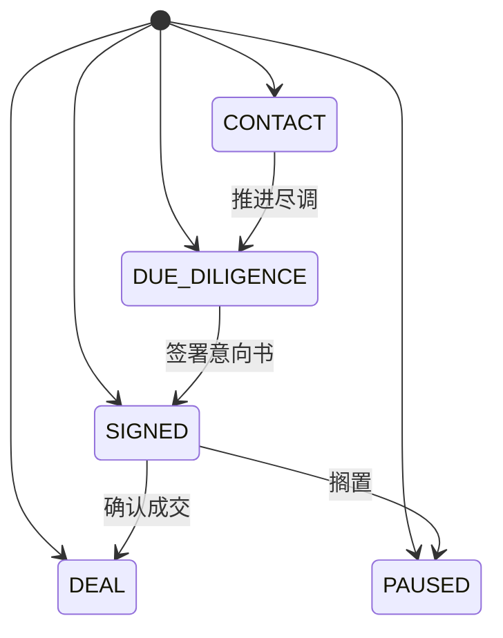

# 03 - 状态矩阵 (技术规格)

> 本文档定义所有实体的状态枚举与状态流转规则，作为状态机实现的依据。

---

## 1. 文档说明

本文档从需求模型提取实体状态枚举与转换规则，用于前后端状态同步与校验。

---

## 2. 状态枚举清单

| 实体 | 状态值 | 显示名称 | 颜色标识 |
|------|--------|---------|---------|
| 专利资产 | ACTIVE | 有效 | success |
| 专利资产 | FEE_WARNING | 年费预警 | warning |
| 专利资产 | EXPIRED | 失效 | danger |
| 估值记录 | PENDING | 待确认 | warning |
| 估值记录 | CONFIRMED | 已确认 | success |
| 年费记录 | PAID | 已缴 | success |
| 年费记录 | PENDING | 待缴 | info |
| 年费记录 | WARNING | 预警 | warning |
| 年费记录 | OVERDUE | 逾期 | danger |
| 质押转让记录 | IN_REVIEW | 审批中 | info |
| 质押转让记录 | ACTIVE | 生效中 | primary |
| 质押转让记录 | RELEASED | 已解除 | success |
| 质押转让记录 | COMPLETED | 已完成 | success |
| 质押转让记录 | REJECTED | 已驳回 | danger |
| 撮合意向 | CONTACT | 初步接触 | info |
| 撮合意向 | DUE_DILIGENCE | 尽调中 | primary |
| 撮合意向 | SIGNED | 签署意向 | warning |
| 撮合意向 | DEAL | 成交 | success |
| 撮合意向 | PAUSED | 搁置 | danger |

---

## 3. 状态转换矩阵

| 实体 | 起始状态 | 目标状态 | 触发动作 | 前置条件 |
|------|---------|---------|---------|---------|
| 专利资产 | ACTIVE | FEE_WARNING | 年费到期前30天自动预警 | 系统自动检测 feeDueDate 距今 30 天内 |
| 专利资产 | FEE_WARNING | ACTIVE | 缴纳年费 | 年费到账登记 |
| 专利资产 | FEE_WARNING | EXPIRED | 逾期未缴自动失效 | 超过年费截止日仍未缴纳 |
| 专利资产 | EXPIRED | ACTIVE | 补缴年费并恢复 | 资产经理审批通过 |
| 估值记录 | PENDING | CONFIRMED | 资产经理确认估值 | 每季度估值需确认后生效 |
| 质押转让记录 | IN_REVIEW | ACTIVE | 审批通过生效 | 质押登记/转让审批 |
| 质押转让记录 | ACTIVE | RELEASED | 解除质押 | 仅质押登记且生效中 |
| 质押转让记录 | ACTIVE | COMPLETED | 转让交割完成 | 仅专利转让且生效中 |
| 撮合意向 | CONTACT | DUE_DILIGENCE | 推进尽调 | 顺序推进 |
| 撮合意向 | DUE_DILIGENCE | SIGNED | 签署意向书 | 顺序推进 |
| 撮合意向 | SIGNED | DEAL | 确认成交 | 顺序推进 |
| 撮合意向 | SIGNED | PAUSED | 搁置 | 终态 |

---

## 4. 状态机图

### 4.1 专利资产 状态机

### 4.2 估值记录 状态机

### 4.3 质押转让记录 状态机

### 4.4 撮合意向 状态机

---

## 5. 状态校验规则

| 规则 | 说明 |
|------|------|
| 后端校验 | 每次状态变更必须校验转换合法性，非法转换返回 422 |
| 前端展示 | 根据当前状态动态显示可执行的操作按钮 |
| 日志记录 | 状态变更记录操作日志，含操作人、时间、前后状态 |
| 并发控制 | 状态变更使用乐观锁（version 字段）防止并发冲突 |

---

> 本文档由 generate-prd.mjs (v5.2.2) 基于 requirement-model.yaml 自动生成（2026-08-28T16:41:57.844Z）
