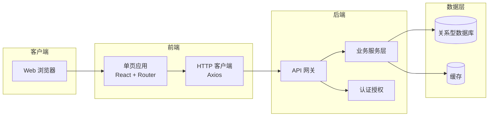
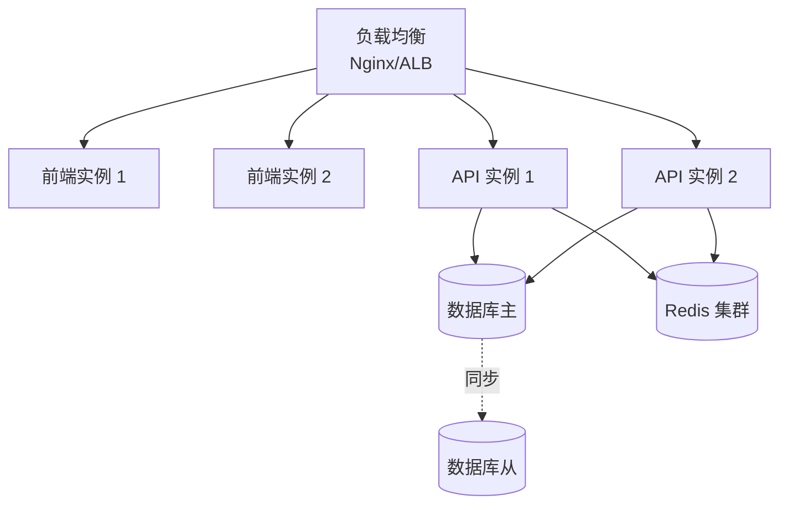

# 00 - 项目总览 (技术规格)

> 本文档为技术规格层面的项目总览，从工程实现视角描述系统架构、技术选型、部署方案等信息。

---

## 1. 文档说明

本文档与 PRD `00-overview.md` 互补：PRD 侧重业务视角，本文档侧重技术实现视角，覆盖架构、技术栈、部署、性能等非功能性需求。

---

## 2. 系统架构

### 2.1 架构概览

本项目采用前后端分离的 B/S 架构，前端单页应用 (SPA) 通过 RESTful API 与后端服务通信，后端按业务模块划分服务边界。

### 2.2 架构图

### 2.3 模块划分

基于需求模型中的 1 个业务实体，系统划分为以下模块：

| 模块 | 核心实体 | 职责 |
|------|---------|------|
| patent-idea管理 | 专利创意 | 专利创意数据的增删改查、状态流转、权限控制 |

---

## 3. 技术栈

### 3.1 前端技术栈

| 类别 | 选型 | 说明 |
|------|------|------|
| 框架 | React 18 | 函数组件 + Hooks 模式 |
| 路由 | React Router v6 | 声明式路由 + 嵌套路由 |
| UI 库 | Ant Design 5 | 企业级中后台组件库 |
| 状态管理 | Zustand / Context | 轻量级状态管理 |
| HTTP 客户端 | Axios | 请求/响应拦截、统一错误处理 |
| 构建工具 | Vite | 快速冷启动 + HMR |
| 语言 | TypeScript | 类型安全 |

### 3.2 后端技术栈

| 类别 | 选型 | 说明 |
|------|------|------|
| 语言 | Node.js / Java / Go | 按团队技术栈选择 |
| API 风格 | RESTful | 资源化 URL + JSON |
| 认证 | JWT + Refresh Token | 无状态认证 |
| 权限模型 | RBAC | 基于角色的访问控制 |
| 数据库 | MySQL / PostgreSQL | 关系型数据库 |
| 缓存 | Redis | 会话/热点数据缓存 |

---

## 4. 部署架构

### 4.1 环境清单

| 环境 | 用途 | 部署方式 |
|------|------|---------|
| 开发环境 (dev) | 开发联调 | 本地 / Docker Compose |
| 测试环境 (test) | QA 测试 | 容器化部署 |
| 预发布环境 (staging) | 上线前验证 | 与生产同构 |
| 生产环境 (prod) | 对外服务 | 容器编排 + 负载均衡 |

### 4.2 部署拓扑

---

## 5. 第三方服务集成

| 服务 | 用途 | 集成方式 |
|------|------|---------|
| 短信服务 | 验证码、通知 | API 调用 |
| 邮件服务 | 系统通知、报表 | SMTP / API |
| 对象存储 | 文件附件 | SDK 上传 |
| 日志服务 | 操作审计、错误追踪 | 日志采集 + ELK |

---

## 6. 性能指标与非功能性需求

| 指标 | 目标值 | 说明 |
|------|--------|------|
| 首屏加载时间 | ≤ 2s | 桌面端 4G 网络 |
| API 平均响应 | ≤ 200ms | P95 ≤ 500ms |
| 并发用户数 | ≥ 500 | 同时在线 |
| 系统可用性 | ≥ 99.5% | 月度 SLA |
| 数据备份 | 每日全量 + 实时增量 | RPO ≤ 1h |

---

## 7. 项目规模

| 维度 | 数量 |
|------|------|
| 业务实体 | 1 |
| 用户角色 | 3 |
| 页面数 | 3 |
| API 接口数（预估） | 8 |

---

> 本文档由 generate-prd.mjs (v5.2.2) 基于 requirement-model.yaml 自动生成（2026-07-21T09:56:38.124Z）
