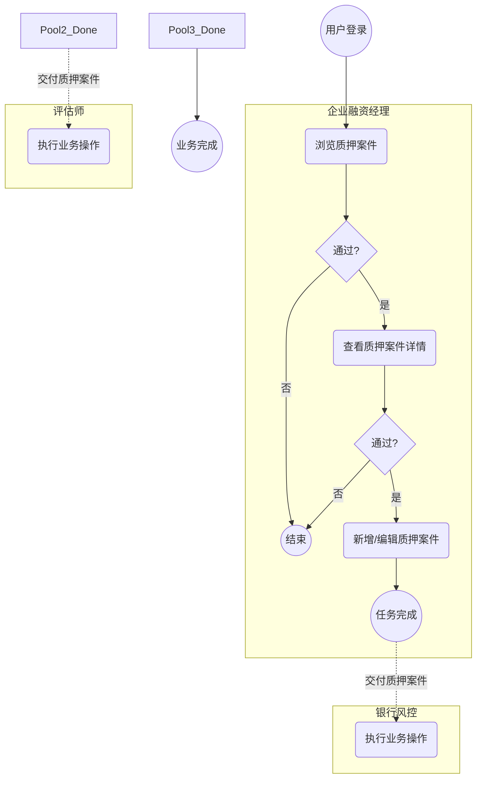
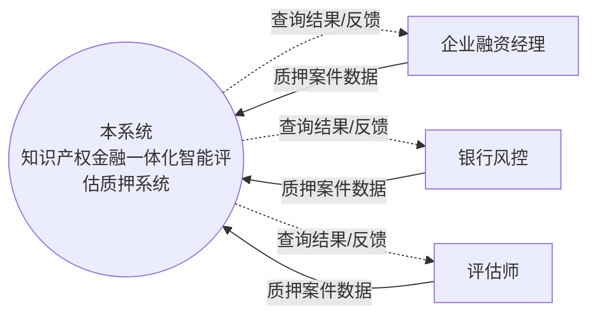
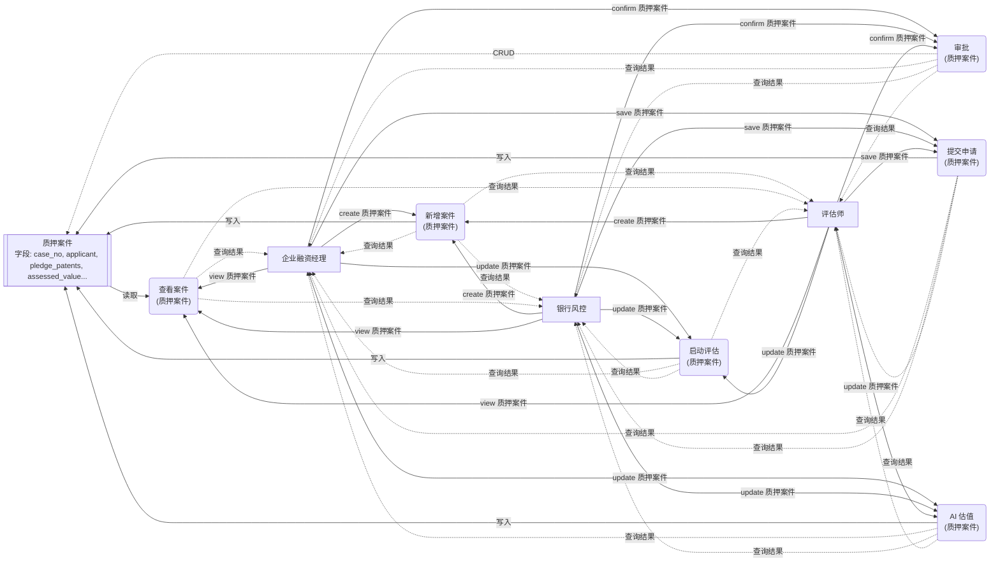
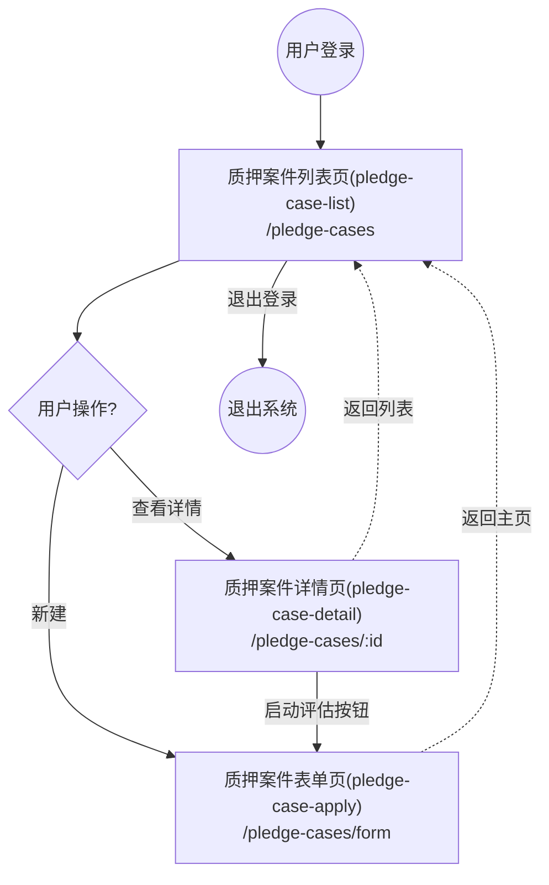
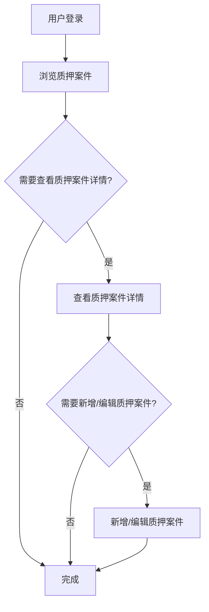
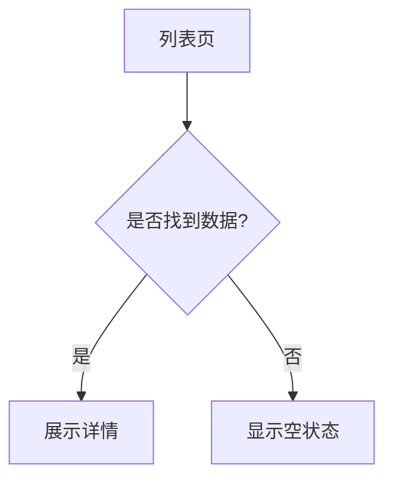

# 04 - 业务流程

> 本文档描述系统的任务流（Task Flow）、数据流（Data Flow）、页面流（Page Flow）、主流程、分支流程、异常流程及状态流转规则。

> 模板版本：v5.7  |  章节契约：与 04-business-flow.md 模板严格对齐

---

## Task Flow（任务流，BPMN 2.0）

> **业界标准**：BPMN 2.0（Business Process Model and Notation）
> **关注点**：用户完成业务任务的操作步骤序列，按角色分 Pool/Lane。
> **图例**：`(( ))` 事件 / `( )` 任务 / `{ }` 网关 / 实线=Sequence Flow / 虚线=Message Flow

### BPMN 任务流图



### 角色任务清单（BPMN Pool/Lane 视角）

| 角色 (Pool) | 任务 (Task) | 触发条件 | 关联页面 | 关联实体 | 交付物 |
|------|------|----------|----------|---------|--------|
| 企业融资经理 | 浏览质押案件 | 登录后进入工作台 | 质押案件列表页(pledge-case-list) | 质押案件 | 业务数据 |
| 银行风控 | 执行业务操作 | 登录后进入工作台 | - | 质押案件 | 业务数据 |
| 评估师 | 执行业务操作 | 登录后进入工作台 | - | 质押案件 | 业务数据 |

### BPMN 元素说明

| 元素类型 | 图例 | 含义 |
|---------|------|------|
| Start Event | `(( ))` 圆形 | 流程起始点（如用户登录） |
| End Event | `(( ))` 双圆 | 流程结束点（如任务完成） |
| Task | `( )` 圆角矩形 | 用户执行的具体业务任务 |
| Gateway (XOR) | `{ }` 菱形 | 排他网关，二选一决策点 |
| Intermediate Event | `{{ }}` 六边形 | 中间事件，如状态流转 |
| Sequence Flow | `-->` 实线箭头 | 同 Pool 内的任务流转 |
| Message Flow | `-.->` 虚线箭头 | 跨 Pool 的消息/数据交付 |
| Pool/Lane | `subgraph` | 角色泳道，划分职责边界 |


---

## Data Flow（数据流，DFD Yourdon-DeMarco）

> **业界标准**：DFD（Data Flow Diagram，Yourdon-DeMarco notation）
> **关注点**：数据在系统各模块/角色间的流动路径，含数据归属与操作权限。
> **图例**：`[ ]` 外部实体 / `( )` 处理过程 / `[[ ]]` 数据存储 / 箭头标签=数据流内容

### Level 0 - 上下文图（Context Diagram）



### Level 1 - 数据流分解图



### 实体数据归属矩阵

| 实体 | 所有者角色 | 可读角色 | 可写角色 | 数据流向 | 主键字段 | 关键字段 |
|------|------------|----------|----------|----------|---------|---------|
| 质押案件 | 企业融资经理 | 企业融资经理/银行风控/评估师 | 企业融资经理/银行风控/评估师 | 企业融资经理 → [质押案件] → 企业融资经理 | id | case_no, applicant, pledge_patents |

### DFD 元素说明

| 元素类型 | 图例 | 含义 |
|---------|------|------|
| External Entity | `[ ]` 矩形 | 系统外部数据来源/去向（角色） |
| Process | `( )` 圆角矩形 | 系统内的处理过程（页面操作） |
| Data Store | `[[ ]]` 双线 | 数据存储（实体表） |
| Data Flow | `-->\|label\|` 带标签箭头 | 数据流向，标签为数据内容 |
| Read Flow | `-.->` 虚线 | 读取/反馈数据流 |
| Write Flow | `-->` 实线 | 写入/提交数据流 |

### 数据流层级说明

- **Level 0 - Context Diagram**：将整个系统视为单一 Process，展示外部实体与系统的交互边界
- **Level 1 - 数据流分解图**：将系统分解为多个 Process（页面操作），展示 Process 与 Data Store（实体）的数据交互
- **建议进一步分解**：复杂 Process 可继续分解为 Level 2 / Level 3 DFD


---

## Page Flow（页面流，UI Flow Diagram）

> **业界标准**：UI Flow Diagram（用户界面流程图）
> **关注点**：页面间的跳转关系，含路由、跳转条件与决策分支。
> **图例**：`(( ))` 起止节点 / `[ ]` 页面 / `{ }` 决策点 / 实线=跳转 / 虚线=返回

### UI Flow 页面跳转图



### 路由表与跳转条件

| 源页面 | 目标页面 | 触发条件 | 传参 | 权限要求 | 跳转类型 |
|--------|----------|----------|------|----------|---------|
| 登录页 | 质押案件列表页(pledge-case-list) | 用户登录成功 | userId | 已认证 | 路由跳转 |
| 质押案件列表页(pledge-case-list) | 质押案件详情页(pledge-case-detail) | 点击新增按钮 | pledge-case | 已认证 | 路由跳转 |
| 质押案件详情页(pledge-case-detail) | 质押案件表单页(pledge-case-apply) | 点击"启动评估"按钮 | pledge-case | 已认证 | 路由跳转 |
| 质押案件表单页(pledge-case-apply) | 质押案件列表页(pledge-case-list) | 点击返回/面包屑 | - | 已认证 | 返回 |

### UI Flow 元素说明

| 元素类型 | 图例 | 含义 |
|---------|------|------|
| Terminator | `(( ))` 圆形 | 流程起始/终止点（如登录、退出） |
| Screen | `[ ]` 矩形 | 系统页面，含路由信息 |
| Decision | `{ }` 菱形 | 用户操作决策点（如查看 vs 新建） |
| Action | `-->\|label\|` 实线箭头 | 用户操作触发的页面跳转 |
| Back Navigation | `-.->\|label\|` 虚线箭头 | 返回上一页或主页 |
| Modal/Drawer | `subgraph` | 弹窗/抽屉式叠加层 |

### 跳转模式说明

- **列表 → 详情**：用户在列表页点击行项目，跳转到详情页查看完整信息
- **列表 → 表单**：用户在列表页点击"新建"按钮，跳转到表单页录入数据
- **详情 → 列表**：用户在详情页点击"返回"，回到列表页
- **任意页 → 主页**：用户点击面包屑或 Logo，返回主页
- **退出登录**：用户点击退出按钮，终止会话


---

## 主流程（业务流程）

> 系统的核心业务流程，端到端的操作序列。

### ASCII 流程图

```ascii
[登录] --> [浏览质押案件]
  |
  v
[查看质押案件详情]
  |
  v
[新增/编辑质押案件]
  |
  v
[完成]
```

### Mermaid 流程图



### 主流程步骤说明

**步骤 1：浏览质押案件**
- 页面 ID：P01
- 页面类型：CRUD 列表页
- 关联实体：质押案件
- 路由：/pledge-cases


**步骤 2：查看质押案件详情**
- 页面 ID：P02
- 页面类型：详情页
- 关联实体：质押案件
- 路由：/pledge-cases/:id


**步骤 3：新增/编辑质押案件**
- 页面 ID：P03
- 页面类型：表单页
- 关联实体：质押案件
- 路由：/pledge-cases/form


---

## 分支流程

### 分支一：数据查询分支



---

## 异常流程

| 异常场景 | 触发条件 | 处理方式 | 提示信息 |
|----------|----------|----------|----------|
| 数据加载失败 | 网络异常或接口超时 | 显示错误状态页，提供重试按钮 | 数据加载失败，请重试 |
| 权限不足 | 用户访问无权限页面或操作 | 路由守卫拦截，跳转 403 页面 | 您无权访问该页面 |
| 数据校验失败 | 表单提交字段不合规 | 表单内联显示校验错误 | 请检查输入内容 |
| 数据不存在 | 访问已删除/不存在的记录 | 显示 404 空状态页 | 该记录不存在或已删除 |
| 并发冲突 | 多人同时编辑同一记录 | 提交时检测版本冲突，提示刷新 | 数据已被他人修改，请刷新后重试 |

---

## 状态流转

| 实体 | 当前状态 | 允许转换到 | 触发操作 | 触发条件 |
|------|----------|------------|----------|----------|
| - | - | - | - | - |

### 各实体状态枚举

- **质押案件**：已申请 / 评估中 / 已审批 / 已登记 / 已放款 / 已还款

> 状态字典定义请参见 `status-dictionary.yaml`（由实体状态枚举自动推导）。


---

> 本文档由 generate-prd.mjs (v5.2.2) 基于 requirement-model.yaml 自动生成（2026-07-21T10:18:59.212Z）
