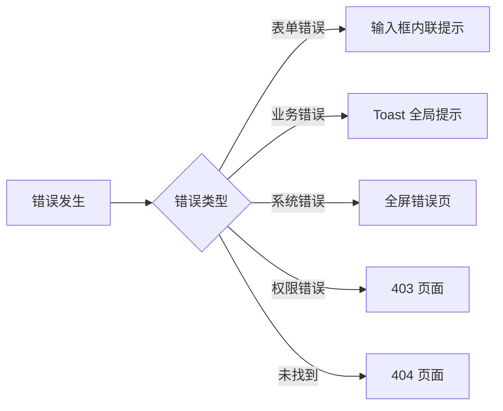

# 06 - 错误与空状态 (技术规格)

> 本文档定义系统各场景下的错误提示、空状态、加载状态的设计规范与实现方案。

---

## 1. 文档说明

本文档基于页面清单与实体定义，统一错误与空状态的设计与实现规范。

---

## 2. 错误状态

### 2.1 错误分类

| 类型 | 触发场景 | 提示方式 | 持续时间 |
|------|---------|---------|---------|
| 表单校验错误 | 字段必填、格式、长度校验 | 输入框下方红色文字 | 持续显示 |
| 业务错误 | 接口返回 4xx | Toast / Notification | 3 秒 |
| 系统错误 | 接口返回 5xx | 全屏错误页 + 重试按钮 | 持续显示 |
| 网络错误 | 请求超时、断网 | Toast + 重试按钮 | 持续显示 |
| 权限错误 | 无权限访问 | 403 页面 | 持续显示 |

### 2.2 错误提示文案规范

| 场景 | 文案 |
|------|------|
| 必填字段为空 | {字段名}不能为空 |
| 字符串超长 | {字段名}不能超过 {n} 个字符 |
| 数值越界 | {字段名}必须在 {min}-{max} 之间 |
| 格式错误 | {字段名}格式不正确 |
| 网络异常 | 网络异常，请检查网络后重试 |
| 系统繁忙 | 系统繁忙，请稍后重试 |
| 无权限 | 您无权访问此功能 |
| 资源不存在 | 资源不存在或已被删除 |

### 2.3 错误页设计



---

## 3. 空状态

### 3.1 空状态场景

| 场景 | 触发条件 | 展示内容 |
|------|---------|---------|
| 列表为空 | 查询结果为 0 条 | 空状态图 + "暂无数据" + 新增按钮 |
| 搜索无结果 | 搜索后无匹配 | 空状态图 + "未找到匹配数据" + 重置按钮 |
| 详情不存在 | 资源被删除 | 空状态图 + "资源不存在" + 返回按钮 |
| 关联数据为空 | 关联标签页无数据 | 空状态图 + "暂无关联数据" |

### 3.2 各页面空状态


#### P01 infringement-case-list

| 场景 | 展示内容 | 操作 |
|------|---------|------|
| 首次进入无数据 | 空状态图 + "暂无侵权案件数据" | [新增侵权案件] 按钮 |
| 搜索无结果 | 空状态图 + "未找到匹配数据" | [重置搜索] 按钮 |
| 筛选无结果 | 空状态图 + "当前筛选条件下无数据" | [清空筛选] 按钮 |

#### P02 infringement-case-detail

| 场景 | 展示内容 | 操作 |
|------|---------|------|
| 首次进入无数据 | 空状态图 + "暂无侵权案件数据" | [新增侵权案件] 按钮 |
| 搜索无结果 | 空状态图 + "未找到匹配数据" | [重置搜索] 按钮 |
| 筛选无结果 | 空状态图 + "当前筛选条件下无数据" | [清空筛选] 按钮 |

#### P03 infringement-monitor-form

| 场景 | 展示内容 | 操作 |
|------|---------|------|
| 首次进入无数据 | 空状态图 + "暂无侵权案件数据" | [新增侵权案件] 按钮 |
| 搜索无结果 | 空状态图 + "未找到匹配数据" | [重置搜索] 按钮 |
| 筛选无结果 | 空状态图 + "当前筛选条件下无数据" | [清空筛选] 按钮 |

---

## 4. 加载状态

### 4.1 加载状态分类

| 场景 | 加载方式 |
|------|---------|
| 页面首次进入 | 全屏 Skeleton 骨架屏 |
| 表格数据请求 | 表格区域 Loading 遮罩 |
| 表单提交 | 按钮 Loading + 禁用 |
| 详情数据请求 | 卡片 Skeleton |
| 下拉数据请求 | Select 占位符 "加载中..." |

### 4.2 加载时长建议

| 时长 | 处理 |
|------|------|
| < 100ms | 不显示 Loading |
| 100ms - 1s | 显示 Loading 遮罩 |
| > 1s | 显示 Skeleton + 进度提示 |
| > 5s | 显示超时提示 + 重试 |

---

## 5. 实现方案

### 5.1 通用错误处理

```typescript
// utils/request.ts
instance.interceptors.response.use(
  (response) => response.data,
  (error) => {
    const { response } = error;
    if (!response) {
      message.error("网络异常，请检查网络后重试");
      return Promise.reject(error);
    }
    const { status, data } = response;
    switch (status) {
      case 401: redirectToLogin(); break;
      case 403: message.error("您无权访问此功能"); break;
      case 404: message.error("资源不存在或已被删除"); break;
      case 422: message.error(data.message || "业务校验失败"); break;
      case 500: message.error("系统繁忙，请稍后重试"); break;
      default: message.error(data.message || "未知错误");
    }
    return Promise.reject(error);
  }
);
```

### 5.2 通用空状态组件

```tsx
// components/common/EmptyState.tsx
interface EmptyStateProps {
  description?: string;
  image?: ReactNode;
  action?: ReactNode;
}
export function EmptyState({ description = "暂无数据", image, action }: EmptyStateProps) {
  return (
    <div className="empty-state">
      {image || <EmptyImage />}
      <p>{description}</p>
      {action}
    </div>
  );
}
```


---

> 本文档由 generate-prd.mjs (v5.2.2) 基于 requirement-model.yaml 自动生成（2026-07-21T10:19:16.170Z）
